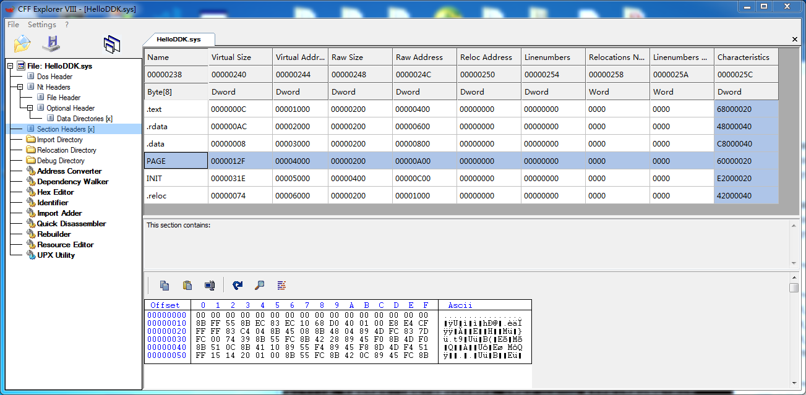
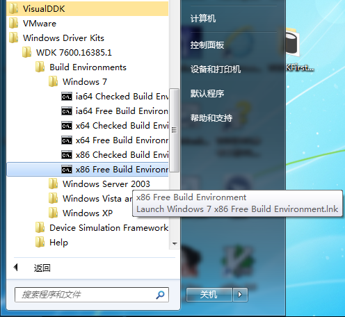

#第一个驱动程序#

这一篇文章列举三类现在用的驱动程序模型的基本程序，包括NT式驱动，WDM驱动程序和WDF驱动程序。列举代码，解析一下程序的基础知识，驱动的编译以及驱动的安装方法。

###NT式驱动程序###

首先给出代码，下面逐一解析，NT式的第一个驱动程序有`Driver.h`和`Driver.cpp`两个文件，代码如下（参考Windows驱动开发技术详解）。

```
// Driver.h
#pragma once

#ifdef __cplusplus
extern "C"
{
#ifdef __cplusplus

#include <ntddk.h>

#endif
}
#endif

#define PAGECODE code_seg("PAGE")
#define LOCKEDCODE code_seg()
#define INITCODE code_seg("INIT")

#define PAGEDATA data_seg("PAGE")
#define LOCKEDDATA data_seg()
#define INITDATA data_seg("INIT")

#define arraysize(p) (sizeof(p)/sizeof((p)[0]))

typedef struct _DEVICE_EXTENSION {
	PDEVICE_OBJECT pDevice;
	UNICODE_STRING ustrDeviceName;	// 设备名称
	UNICODE_STRING ustrSymLinkName;	// 符号链接名
}DEVICE_EXTENSION, *PDEVICE_EXTENSION;

NTSTATUS CreateDevice(IN PDRIVER_OBJECT pDriverObject);
VOID HelloDDKUnload(IN PDRIVER_OBJECT pDriverObject);
NTSTATUS HelloDDKDispatchRoutine(IN PDEVICE_OBJECT pDevObj, IN PIRP pIrp);
```

如同Win32应用程序开发中需要`windows.h`一样，在驱动开发中也需要一个公共的头文件`ntddk.h`（用于NT式驱动程序）。

对`__cplusplus`是否定义的判断语句，用于头文件兼容处理。如果头文件被包含在`C++`的源码文件中，使得编译时将其中包含内容按照C语言编译形式处理，应用程序开发也有类似的处理。

定义了三个宏，方便将函数定义分配到不同属性的代码段中，分页标记`PAGECODE`表示它标注函数放到独立的分区（section）中，这个分区可以使用分页内存；非分页标记`LOCKEDCODE`表示将函数放到使用非分页内存的PE分区中，在驱动执行时这块分区是不能放到分页内存，也即不能被换页出去到磁盘上；最后一个标记是初始化标记`INITCODE`，它表示将有该标记的函数放到PE中的独立分区，在驱动初始化完成后即可将它占用内存块卸载掉了，减少内存使用。编译后如下图1所示，SYS文件中多了两个Section。



在下面定义了设备扩展的结构，这个结构为程序员自定义，这个里面放置了设备名，设备的符号链接名（给应用程序打开驱动使用），以及设备对象指针（这里指向扩展内容所对应的设备对象）。

```
// Driver.cpp
#include "Driver.h"

#pragma INITCODE
extern "C" NTSTATUS DriverEntry(
		   IN PDRIVER_OBJECT pDriverObject,
		   IN PUNICODE_STRING pRegistryPath)
{
	NTSTATUS status;
	KdPrint(("Enter DriverEntry\n"));

	pDriverObject->DriverUnload = HelloDDKUnload;
	pDriverObject->MajorFunction[IRP_MJ_CREATE] = HelloDDKDispatchRoutine;
	pDriverObject->MajorFunction[IRP_MJ_READ] = HelloDDKDispatchRoutine;
	pDriverObject->MajorFunction[IRP_MJ_WRITE] = HelloDDKDispatchRoutine;
	pDriverObject->MajorFunction[IRP_MJ_CLOSE] = HelloDDKDispatchRoutine;

	status = CreateDevice(pDriverObject);

	KdPrint(("DriverEntry end\n"));
	return status;
}

#pragma INITCODE
NTSTATUS CreateDevice(IN PDRIVER_OBJECT pDriverObject)
{
	NTSTATUS status;
	PDEVICE_OBJECT pDevObj;
	PDEVICE_EXTENSION pDevExt;

	// 创建设备名
	UNICODE_STRING devName;
	RtlInitUnicodeString(&devName, L"\\Device\\MyDDKDevice");
	status = IoCreateDevice(pDriverObject,			// 创建设备
							sizeof(DEVICE_EXTENSION),
							&(UNICODE_STRING)devName,
							FILE_DEVICE_UNKNOWN,
							0, TRUE,
							&pDevObj);
	if (!NT_SUCCESS(status))
		return status;

	pDevObj->Flags |= DO_BUFFERED_IO;
	pDevExt = (PDEVICE_EXTENSION)pDevObj->DeviceExtension;
	pDevExt->pDevice = pDevObj;
	pDevExt->ustrDeviceName = devName;

	// 符号链接
	UNICODE_STRING symLinkName;
	RtlInitUnicodeString(&symLinkName, L"\\??\\HelloDDK");
	pDevExt->ustrSymLinkName = symLinkName;
	status = IoCreateSymbolicLink(&symLinkName, &devName);
	if(!NT_SUCCESS(status))
	{
		IoDeleteDevice(pDevObj);
		return status;
	}

	return STATUS_SUCCESS;
}

#pragma PAGECODE
VOID HelloDDKUnload(IN PDRIVER_OBJECT pDriverObject)
{
	PDEVICE_OBJECT pNextObj;
	KdPrint(("Enter DriverUnload\n"));
	pNextObj = pDriverObject->DeviceObject;
	while(pNextObj != NULL)
	{
		PDEVICE_EXTENSION pDevExt = (PDEVICE_EXTENSION)pNextObj->DeviceExtension;

		// 删除符号
		UNICODE_STRING pLinkName = pDevExt->ustrSymLinkName;
		IoDeleteSymbolicLink(&pLinkName);
		pNextObj = pNextObj->NextDevice;
		IoDeleteDevice(pDevExt->pDevice);
	}
}

#pragma PAGECODE
NTSTATUS HelloDDKDispatchRoutine(IN PDEVICE_OBJECT pDevObj,
								 IN PIRP pIrp)
{
	KdPrint(("Enter HelloDDKDispatchRoutine\n"));
	NTSTATUS status = STATUS_SUCCESS;

	// 完成IRP
	pIrp->IoStatus.Status = status;
	pIrp->IoStatus.Information = 0;
	IoCompleteRequest(pIrp, IO_NO_INCREMENT);
	KdPrint(("Leave HelloDDKDispatchRoutine\n"));
	return status;
}
```

应用程序开发时，都会有一个入口函数，比如控制台程序的`main()`函数。驱动程序也需要入口函数，它的入口函数为`DriverEntry`，如上述代码块中所示。驱动入口函数主要是初始化驱动程序，定位和申请硬件资源，创建内核对象等，`DriverEntry`由内核中的`I/O`管理器负责调用。对于入口函数的两个参数需要多说一点，参数`PDRIVER_OBJECT pDriverObject`是`I/O`管理器中传递进来的驱动对象，它用于表示当前的驱动程序；参数`PUNICODE_STRING pRegistryPath`是一个指针，指向Unicode字符串，博阿含了此驱动所使用的注册表项。

类型`DRIVER_OBJECT`下面给出一个详细的内容，它的定义可以从`ntddk.h`中找到，如下所示。将它各个成员的含义用注释标注。

```
typedef struct _DRIVER_OBJECT {
    CSHORT Type;					// 驱动类型
    CSHORT Size;					// 驱动对象大小
    PDEVICE_OBJECT DeviceObject;	// 驱动所创建的设备对象，它是一个列表
    ULONG Flags;					// 驱动程序的标记，DO_BUFFERED_IO缓存I/O型驱动
	// 下面几项描述驱动加载位置
    PVOID DriverStart;				// 驱动的PE入口函数，非DriverEntry
    ULONG DriverSize;				// 驱动大小
    PVOID DriverSection;			// 驱动区段，用于遍历系统所有的驱动
    PDRIVER_EXTENSION DriverExtension;	// 驱动扩展的指针，注意与设备扩展区分，那个是自定义
    UNICODE_STRING DriverName;		// 驱动名称，用于错误日志确定驱动名称
    PUNICODE_STRING HardwareDatabase;// 注册表支持，指向字符串为注册表中硬件信息路径
	// 快速I/O通过使用参数直接调用驱动函数，而不是通过标准IRP机制。
    // 这个机制进用于同步I/O，并且当文件已经被缓存了。
    PFAST_IO_DISPATCH FastIoDispatch;// 指向可选指针表，它用于驱动的快速I/O支持
	// 如下几个字段描述了特殊驱动使用的函数入口指针
    PDRIVER_INITIALIZE DriverInit;	 // 
    PDRIVER_STARTIO DriverStartIo;	 // 
    PDRIVER_UNLOAD DriverUnload;	 // 驱动卸载函数
    PDRIVER_DISPATCH MajorFunction[IRP_MJ_MAXIMUM_FUNCTION + 1]; // IRP处理函数
} DRIVER_OBJECT;
typedef struct _DRIVER_OBJECT *PDRIVER_OBJECT;
```

> 因为源文件使用了`.cpp`后缀，所以DriverEntry函数前面需要`extern "C"`，表明将该函数以C编译风格进行编译，防止链接时找不到驱动入口函数。

在入口函数中调用了`CreateDevice`创建了设备对象，并且向`I/O`管理器注册了一些回调函数，这些回调函数有程序员定义，由操作系统负责调用。比如当驱动卸载时会调用驱动对象中的`DriverUnload`成员所指向函数，即我们这里的`HelloDDKUnload`。

`CreateDevice`是一个辅助函数，用于创建设备驱动。`IoCreateDevice`函数创建设备对象，设备类型为`FILE_DEVICE_UNKNOWN`，这种设备为独占设备，只能被一个应用程序使用。下面在调用`IoCreateSymbolicLink`用于创建设备对象的符号链接，用于应用程序打开驱动时用。

`HelloDDKUnload`函数为卸载驱动例程，当驱动程序被卸载时，由`I/O`管理器负责调用此回调函数。该函数遍历此驱动程序中创建的所有设备对象，驱动对象的`DeviceObject`成员中保存了创建的第一个设备对象地址，而每一个设备对象的`NextDevice`域记录了该驱动创建的下一个设备对象的地址，这样就形成了一个链表。卸载驱动函数就是遍历链表，删除所有设备对象及其符号链接。

函数`HelloDDKDispatchRoutine`是默认的派遣函数，在入口函数中将设备对象的创建，关闭和读写操作都指定到了这个默认的派遣函数了。默认的派遣函数中也非常简单，设置IRP状态为成功，只是完成此IRP，最后返回成功。

**NT式驱动编译**

先说驱动编译的方式都有哪些呢？如下列举出了一些！

1. 手动一行一行输入编译命令行和链接行。
2. 建立makefile文件，用nmake工具进行编译
3. 建立makefile，sources，dirs文件用build工具编译
4. 修改VC集成开发环境中Win32程序编译设置编译驱动
5. 使用VirtualDDK，DDKWizard集成到低版本的VS中模板创建工程编译，同时包括EasySys创建编译工程
6. 使用高版本的Visual Studio，比如VS2015等。

其中最为方便的当属于直接使用`Visual Studio 2013`或更高版本，它们直接创建出编译工程来，如下图为VS2017中创建驱动工程。


如果说机器性能不好，只能用VS2008或更低版本，那么安装一个VirtualDDK或DDKWizard是个不错的选择，它们也可以直接创建VS中直接编译的工程。如下两个图所示，在创建Project中就有了VisualDDK选项，选中后在驱动模型中还可以选择传统的NT驱动和WDM驱动。


如果更简单的方式，则是编写makefile，sources，dirs文件，直接使用WDK提供的编译命令行运行build命令进行编译了。如图5为WDK7600中提供的编译命令行环境。



其他的就不再详细说了，其实这些编译方式最终都要使用`cl.exe`和`link.exe`进行编译链接；而这些使用VS建立工程的方式（高版本VS除外）最终也是使用`nmake`的方式建立工程，编译时一样需要运行`build`命令解析sources文件进行编译。所以这里防止以后对于这些内容配置错误而无所适从，我们从驱动编译的基础方式——编写makefile和sources文件——这种方式为例进行（其他方式只是对这种方式的包装，当出现了问题看这些参数就知道为何了）。

```
// makefile
!INCLUDE $(NTMAKEENV)/makefile.def
```

```
// sources
TARGETNAME=HelloDDK
TARGETTYPE=DRIVER
TARGETPATH=OBJ

INCLUDES=$(BASEDIR)\inc; \
		 $(BASEDIR)\inc\ddk;\

SOURCES=Driver.cpp\
```

`DDKWizard`的下载地址[https://bitbucket.org/assarbad/ddkwizard/overview](https://bitbucket.org/assarbad/ddkwizard/overview)

下载`VisualDDK`地址[http://visualddk.sysprogs.org/](http://visualddk.sysprogs.org/)


**NT式驱动安装**

加载NT式驱动可以使用`DriverMonitor`


###WDM驱动程序###

第一个WDM驱动程序例子的代码如下两个代码块所示，在后面对两个代码块做详细解释。

```
// Driver.h
#pragma once

#ifdef __cplusplus
extern "C" {
#endif

#include <wdm.h>

#ifdef __cplusplus
};
#endif

typedef struct _DEVICE_EXTENSION
{
	PDEVICE_OBJECT fdo;
	PDEVICE_OBJECT NextStackDevice;
	UNICODE_STRING ustrDeviceName;	// 设备名字
	UNICODE_STRING ustrSymLinkName;	// 符号链接
}DEVICE_EXTENSION, *PDEVICE_EXTENSION;

#define PAGECODE code_seg("PAGE")
#define LOCKEDCODE code_seg()
#define INITCODE code_seg("INIT")

#define PAGEDATA data_seg("PAGE")
#define LOCKEDDATA data_seg()
#define INITDATA data_seg("INIT")

#define arraysize(p) (sizeof(p)/sizeof((p)[0]))

NTSTATUS HelloWDMAddDevice(IN PDRIVER_OBJECT pDriverObject,
						   IN PDEVICE_OBJECT PhysicalDeviceObject);
NTSTATUS HelloWDMPnp(IN PDEVICE_OBJECT fdo,
					 IN PIRP pIrp);
NTSTATUS HelloWDMDispatchRoutine(IN PDEVICE_OBJECT fdo,
								 IN PIRP pIrp);
void HelloWDMUnload(IN PDRIVER_OBJECT pDriverObject);

extern "C"
NTSTATUS DriverEntry(IN PDRIVER_OBJECT pDriverObject,
					 IN PUNICODE_STRING pRegistryPath);
```

其实头文件`Driver.h`与NT式驱动程序类似，只是它包含的公共头文件变成了WDM驱动专用的`wdm.h`。

```
// Driver.cpp
#include "Driver.h"

#pragma INITCODE
extern "C"
NTSTATUS DriverEntry(IN PDRIVER_OBJECT pDriverObject,
					 IN PUNICODE_STRING pRegistryPath)
{
	KdPrint(("Enter DriverEntry\n"));

	pDriverObject->DriverExtension->AddDevice = HelloWDMAddDevice;
	pDriverObject->MajorFunction[IRP_MJ_PNP] = HelloWDMPnp;
	pDriverObject->MajorFunction[IRP_MJ_DEVICE_CONTROL] =
	pDriverObject->MajorFunction[IRP_MJ_CREATE] =
	pDriverObject->MajorFunction[IRP_MJ_READ] =
	pDriverObject->MajorFunction[IRP_MJ_WRITE] = HelloWDMDispatchRoutine;
	pDriverObject->DriverUnload = HelloWDMUnload;

	KdPrint(("Leave DriverEntry\n"));
	return STATUS_SUCCESS;
}

#pragma PAGECODE
NTSTATUS HelloWDMAddDevice(IN PDRIVER_OBJECT pDriverObject,
						   IN PDEVICE_OBJECT PhysicalDeviceObject)
{
	PAGED_CODE();
	KdPrint(("Enter HelloWDMAddDevice\n"));

	NTSTATUS status;
	PDEVICE_OBJECT fdo;
	UNICODE_STRING devName;
	RtlInitUnicodeString(&devName, L"\\Device\\MyWDMDevice");
	status = IoCreateDevice(pDriverObject,
							sizeof(DEVICE_EXTENSION),
							&(UNICODE_STRING)devName,
							FILE_DEVICE_UNKNOWN,
							0,
							FALSE,
							&fdo);
	if (!NT_SUCCESS(status))
		return status;

	PDEVICE_EXTENSION pdx = (PDEVICE_EXTENSION)fdo->DeviceExtension;
	pdx->fdo = fdo;
	pdx->NextStackDevice = IoAttachDeviceToDeviceStack(fdo, PhysicalDeviceObject);

	UNICODE_STRING symLinkName;
	RtlInitUnicodeString(&symLinkName, L"\\DosDevices\\HelloWDM");
	pdx->ustrDeviceName = devName;
	pdx->ustrSymLinkName = symLinkName;

	status = IoCreateSymbolicLink(&(UNICODE_STRING)symLinkName, &(UNICODE_STRING)devName);
	if (!NT_SUCCESS(status))
	{
		IoDeleteSymbolicLink(&pdx->ustrSymLinkName);
		status = IoCreateSymbolicLink(&symLinkName, &devName);
		if (!NT_SUCCESS(status))
		{
			return status;
		}
	}

	fdo->Flags |= DO_BUFFERED_IO | DO_POWER_PAGABLE;
	fdo->Flags &= ~ DO_DEVICE_INITIALIZING;
	KdPrint(("Leave HelloWDMAddDevice\n"));
	return STATUS_SUCCESS;
}

#pragma PAGECODE
NTSTATUS DefaultPnpHandler(PDEVICE_EXTENSION pdx, PIRP Irp)
{
	PAGED_CODE();
	KdPrint(("Enter DefaultPnpHandler\n"));
	IoSkipCurrentIrpStackLocation(Irp);
	KdPrint(("Leave DefaultPnpHandler\n"));
	return IoCallDriver(pdx->NextStackDevice, Irp);
}

#pragma PAGECODE
NTSTATUS HandleRemoveDevice(PDEVICE_EXTENSION pdx, PIRP Irp)
{
	PAGED_CODE();
	KdPrint(("Enter HandleRemoveDevice\n"));

	Irp->IoStatus.Status = STATUS_SUCCESS;
	NTSTATUS status = DefaultPnpHandler(pdx, Irp);
	IoDeleteSymbolicLink(&pdx->ustrSymLinkName);

	if (pdx->NextStackDevice)
	{
		IoDetachDevice(pdx->NextStackDevice);
	}

	IoDeleteDevice(pdx->fdo);
	KdPrint(("Leave HandleRemoveDevice\n"));
	return status;
}

#pragma PAGECODE
NTSTATUS HelloWDMPnp(IN PDEVICE_OBJECT fdo,
					 IN PIRP pIrp)
{
	PAGED_CODE();
	KdPrint(("Enter HelloWDMPnp\n"));

	NTSTATUS status = STATUS_SUCCESS;
	PDEVICE_EXTENSION pdx = (PDEVICE_EXTENSION)fdo->DeviceExtension;
	PIO_STACK_LOCATION stack = IoGetCurrentIrpStackLocation(pIrp);
	static NTSTATUS (*fcntab[])(PDEVICE_EXTENSION pdx, PIRP pIrp) = 
	{
		DefaultPnpHandler,	//IRP_MN_START_DEVICE
		DefaultPnpHandler,	//IRP_MN_QUERY_REMOVE_DEVICE
		HandleRemoveDevice,	//IRP_MN_REMOVE_DEVICE
		DefaultPnpHandler,	//IRP_MN_CANCEL_REMOVE_DEVICE
		DefaultPnpHandler,	//IRP_MN_STOP_DEVICE
		DefaultPnpHandler,	//IRP_MN_QUERY_STOP_DEVICE
		DefaultPnpHandler,	//IRP_MN_CANCEL_STOP_DEVICE
		DefaultPnpHandler,	//IRP_MN_QUERY_DEVICE_RELATIONS
		DefaultPnpHandler,	//IRP_MN_QUERY_INTERFACE
		DefaultPnpHandler,	//IRP_MN_QUERY_CAPABILITIES
		DefaultPnpHandler,	//IRP_MN_QUERY_RESOURCES
		DefaultPnpHandler,	//IRP_MN_QUERY_RESOURCE_REQUIREMENTS
		DefaultPnpHandler,	//IRP_MN_QUERY_DEVICE_TEXT
		DefaultPnpHandler,	//IRP_MN_FILTER_RESOURCE_REQUIREMENTS
		DefaultPnpHandler,	//
		DefaultPnpHandler,	//IRP_MN_READ_CONFIG
		DefaultPnpHandler,	//IRP_MN_WRITE_CONFIG
		DefaultPnpHandler,	//IRP_MN_EJECT
		DefaultPnpHandler,	//IRP_MN_SET_LOCK
		DefaultPnpHandler,	//IRP_MN_QUERY_ID
		DefaultPnpHandler,	//IRP_MN_QUERY_PNP_DEVICE_STATE
		DefaultPnpHandler,	//IRP_MN_QUERY_BUS_INFORMATION
		DefaultPnpHandler,	//IRP_MN_DEVICE_USAGE_NOTIFICATION
		DefaultPnpHandler,	//IRP_MN_SURPRISE_REMOVAL
	};

	ULONG fcn = stack->MinorFunction;
	if (fcn >= arraysize(fcntab))
	{
		status = DefaultPnpHandler(pdx, pIrp);
		return status;
	}

#if DBG
	static char * fcnname[] =
	{
		"IRP_MN_START_DEVICE",
		"IRP_MN_QUERY_REMOVE_DEVICE",
		"IRP_MN_REMOVE_DEVICE",
		"IRP_MN_CANCEL_REMOVE_DEVICE",
		"IRP_MN_STOP_DEVICE",
		"IRP_MN_QUERY_STOP_DEVICE",
		"IRP_MN_CANCEL_STOP_DEVICE",
		"IRP_MN_QUERY_DEVICE_RELATIONS",
		"IRP_MN_QUERY_INTERFACE",
		"IRP_MN_QUERY_CAPABILITIES",
		"IRP_MN_QUERY_RESOURCESs",
		"IRP_MN_QUERY_RESOURCE_REQUIREMENTS",
		"IRP_MN_QUERY_DEVICE_TEXT",
		"IRP_MN_FILTER_RESOURCE_REQUIREMENTS",
		"",
		"IRP_MN_READ_CONFIG",
		"IRP_MN_WRITE_CONFIG",
		"IRP_MN_EJECT",
		"IRP_MN_SET_LOCK",
		"IRP_MN_QUERY_ID",
		"IRP_MN_QUERY_PNP_DEVICE_STATE",
		"IRP_MN_QUERY_BUS_INFORMATION",
		"IRP_MN_DEVICE_USAGE_NOTIFICATION",
		"IRP_MN_SURPRISE_REMOVAL",
	};

	KdPrint(("PNP Request (%s)\n", fcnname[fcn]));
#endif

	status = (*fcntab[fcn])(pdx, pIrp);

	KdPrint(("LeaveHelloWDMPnp\n"));
	return STATUS_SUCCESS;
}
NTSTATUS HelloWDMDispatchRoutine(IN PDEVICE_OBJECT fdo,
								 IN PIRP pIrp)
{
	PAGED_CODE();
	KdPrint(("Enter HelloWDMDispatchRoutine\n"));

	pIrp->IoStatus.Status = STATUS_SUCCESS;
	pIrp->IoStatus.Information = 0;
	IoCompleteRequest(pIrp, IO_NO_INCREMENT);
	KdPrint(("Leave HelloWDMDispatchRoutine\n"));
	return STATUS_SUCCESS;
}

void HelloWDMUnload(IN PDRIVER_OBJECT pDriverObject)
{
	PAGED_CODE();
	KdPrint(("Enter HelloWDMUnload\n"));
	KdPrint(("Leave HelloWDMUnload\n"));
}
```

在WDM驱动程序入口函数中多了`AddDevice`回调函数设置，NT驱动中没有此回调函数，它的作用是创建设备对象，由PnP（即插即用）管理器负责调用。再者是`IRP_MJ_PNP`的IRP回调函数设置，该回调函数负责PnP的IRP处理，它也是NT式驱动与WDM驱动的区别之一。

函数`HelloWDMAddDevice`在入口函数中设置给了驱动扩展中的`AddDevice`域，它用于创建设备对象，前面知道NT式驱动在入口函数中创建设备对象，WDM驱动中需要注册`AddDevice`回调例程，即我们这里说的这个函数。该函数有两个参数，参数`PDRIVER_OBJECT pDriverObject`和入口函数的参数之一一样，由PnP管理器传递进来；参数`PDEVICE_OBJECT PhysicalDeviceObject`是PnP管理器传递进来的底层驱动设备对象，这个也是NT式驱动中没有的概念。

在`HelloWDMAddDevice`函数中有一个`PAGED_CODE()`，它是DDK提供的宏，在check版本有效，一旦该函数运行时所处的中断请求级别高于`APC_LEVEL`就会出现断言。这是用于确保代码使用可分页内存，否则可能出现问题。创建设备对象类似与NT式驱动，除了NT式驱动一样创建对象，创建符号链接外，还需要调用`IoAttachDeviceToDeviceStack`函数将此设备对象挂接在设备栈中。

函数`HelloWDMPnp`为WDM处理PnP的回调函数，`IRP_MJ_PNP`会细分为若干子类，当前就对`IRP_MN_REMOVE_DEVICE`做了特护处理，调用`HandleRemoveDevice`；其他的子类则调用默认的处理函数`DefaultPnpHandler`。在函数`HandleRemoveDevice`中完成了NT驱动中`DriverUnload`的逻辑，这里还多了一个逻辑是调用`IoDetachDevice`函数将当前的设备对象从底层设备对象中摘除。`DefaultPnpHandler`函数中只是简单调用`IoSkipCurrentIrpStackLocation`将当前`IRP`栈跳过，然后调用`IoCallDriver`将IRP传递给底层的设备对象处理。

函数`HelloWDMDispatchRoutine`和NT式驱动中类似，不再详述。驱动卸载例程`HelloWDMUnload`中工作被前面的函数简化了，所以在该函数中不需要再做什么工作。

加载WDM驱动可以使用`EzDriverInstaller`程序。

###WDF驱动程序###

待添加

###驱动调试###


如果要调试驱动，则需要在驱动入口处设置断点。使用内联汇编`__asm{int 3;}`。为了X86和X64统一这里可以使用`DebugBreak()`或`KdBreakPoint()`。


**参考文章**

1. 《Windows驱动开发技术详解》
2. [VS2013 WDK8.1驱动开发1](http://www.coderjie.com/blog/91a5722cdd2d11e6841d00163e0c0e36)

By Andy@2018-11-15 09:48:52
