#第一个驱动程序#

这一篇文章列举三类现在用的驱动程序模型的基本程序，包括NT式驱动，WDM驱动程序和WDF驱动程序。列举代码，解析一下程序的基础知识，驱动的编译以及驱动的安装方法。

###NT式驱动程序###

首先给出代码，下面逐一解析，NT式的第一个驱动程序有`Driver.h`和`Driver.cpp`两个文件，代码如下（参考Windows驱动开发技术详解）。

```
// Driver.h
#pragma once

#ifdef __cplusplus
extern "C"
{
#ifdef __cplusplus

#include <ntddk.h>

#endif
}
#endif

#define PAGECODE code_seg("PAGE")
#define LOCKEDCODE code_seg()
#define INITCODE code_seg("INIT")

#define PAGEDATA data_seg("PAGE")
#define LOCKEDDATA data_seg()
#define INITDATA data_seg("INIT")

#define arraysize(p) (sizeof(p)/sizeof((p)[0]))

typedef struct _DEVICE_EXTENSION {
	PDEVICE_OBJECT pDevice;
	UNICODE_STRING ustrDeviceName;	// 设备名称
	UNICODE_STRING ustrSymLinkName;	// 符号链接名
}DEVICE_EXTENSION, *PDEVICE_EXTENSION;

NTSTATUS CreateDevice(IN PDRIVER_OBJECT pDriverObject);
VOID HelloDDKUnload(IN PDRIVER_OBJECT pDriverObject);
NTSTATUS HelloDDKDispatchRoutine(IN PDEVICE_OBJECT pDevObj, IN PIRP pIrp);
```

如同Win32应用程序开发中需要`windows.h`一样，在驱动开发中也需要一个公共的头文件`ntddk.h`（用于NT式驱动程序）。

对`__cplusplus`是否定义的判断语句，用于头文件兼容处理。如果头文件被包含在`C++`的源码文件中，使得编译时将其中包含内容按照C语言编译形式处理，应用程序开发也有类似的处理。

定义了三个宏，方便将函数定义分配到不同属性的代码段中，分页标记`PAGECODE`表示它标注函数放到独立的分区（section）中，这个分区可以使用分页内存；非分页标记`LOCKEDCODE`表示将函数放到使用非分页内存的PE分区中，在驱动执行时这块分区是不能放到分页内存，也即不能被换页出去到磁盘上；最后一个标记是初始化标记`INITCODE`，它表示将有该标记的函数放到PE中的独立分区，在驱动初始化完成后即可将它占用内存块卸载掉了，减少内存使用。编译后如下图1所示，SYS文件中多了两个Section。


在下面定义了设备扩展的结构，这个结构为程序员自定义，这个里面放置了设备名，设备的符号链接名（给应用程序打开驱动使用），以及设备对象指针（这里指向扩展内容所对应的设备对象）。

```
// Driver.cpp
#include "Driver.h"

WCHAR* s_lpDeviceName = L"\\Device\\MyDDKDevice";
WCHAR* s_lpSymbolicName = L"\\??\\HelloDDK";

#pragma INITCODE
extern "C" NTSTATUS DriverEntry(
		   IN PDRIVER_OBJECT pDriverObject,
		   IN PUNICODE_STRING pRegistryPath)
{
	NTSTATUS status;
    //KdBreakPoint();
    KdPrint(("Enter DriverEntry\n"));

	pDriverObject->DriverUnload = HelloDDKUnload;
	pDriverObject->MajorFunction[IRP_MJ_CREATE] = HelloDDKDispatchRoutine;
	pDriverObject->MajorFunction[IRP_MJ_READ] = HelloDDKDispatchRoutine;
	pDriverObject->MajorFunction[IRP_MJ_WRITE] = HelloDDKDispatchRoutine;
	pDriverObject->MajorFunction[IRP_MJ_CLOSE] = HelloDDKDispatchRoutine;

	status = CreateDevice(pDriverObject);

	KdPrint(("Leave DriverEntry\n"));
	return status;
}

#pragma INITCODE
NTSTATUS CreateDevice(IN PDRIVER_OBJECT pDriverObject)
{
	NTSTATUS status;
	PDEVICE_OBJECT pDevObj;
	PDEVICE_EXTENSION pDevExt;

	// 创建设备名
	UNICODE_STRING devName;
	RtlInitUnicodeString(&devName, s_lpDeviceName);
	status = IoCreateDevice(pDriverObject,			// 创建设备
							sizeof(DEVICE_EXTENSION),
							&(UNICODE_STRING)devName,
							FILE_DEVICE_UNKNOWN,
							0, TRUE, 
							&pDevObj);
	if (!NT_SUCCESS(status))
		return status;

	pDevObj->Flags |= DO_BUFFERED_IO;
	pDevExt = (PDEVICE_EXTENSION)pDevObj->DeviceExtension;
	pDevExt->pDevice = pDevObj;
	pDevExt->ustrDeviceName = devName;

	// 符号链接
	UNICODE_STRING symLinkName;
	RtlInitUnicodeString(&symLinkName, s_lpSymbolicName);
	pDevExt->ustrSymLinkName = symLinkName;
	status = IoCreateSymbolicLink(&symLinkName, &devName);
	if(!NT_SUCCESS(status))
	{
		IoDeleteDevice(pDevObj);
		return status;
	}

	return STATUS_SUCCESS;
}

#pragma PAGECODE
VOID HelloDDKUnload(IN PDRIVER_OBJECT pDriverObject)
{
    //KdBreakPoint();
	PDEVICE_OBJECT pNextObj;
	KdPrint(("Enter DriverUnload\n"));
	pNextObj = pDriverObject->DeviceObject;
	while(pNextObj != NULL)
	{
		PDEVICE_EXTENSION pDevExt = (PDEVICE_EXTENSION)pNextObj->DeviceExtension;

		// 删除符号
		UNICODE_STRING pLinkName = pDevExt->ustrSymLinkName;
		IoDeleteSymbolicLink(&pLinkName);
		pNextObj = pNextObj->NextDevice;
		IoDeleteDevice(pDevExt->pDevice);
	}
	KdPrint(("Leave DriverUnload\n"));
}

#pragma PAGECODE
NTSTATUS HelloDDKDispatchRoutine(IN PDEVICE_OBJECT pDevObj,
								 IN PIRP pIrp)
{
	KdPrint(("Enter HelloDDKDispatchRoutine\n"));
	NTSTATUS status = STATUS_SUCCESS;

	// 完成IRP
	pIrp->IoStatus.Status = status;
	pIrp->IoStatus.Information = 0;
	IoCompleteRequest(pIrp, IO_NO_INCREMENT);
	KdPrint(("Leave HelloDDKDispatchRoutine\n"));
	return status;
}
```

应用程序开发时，都会有一个入口函数，比如控制台程序的`main()`函数。驱动程序也需要入口函数，它的入口函数为`DriverEntry`，如上述代码块中所示。驱动入口函数主要是初始化驱动程序，定位和申请硬件资源，创建内核对象等，`DriverEntry`由内核中的`I/O`管理器负责调用。对于入口函数的两个参数需要多说一点，参数`PDRIVER_OBJECT pDriverObject`是`I/O`管理器中传递进来的驱动对象，它用于表示当前的驱动程序；参数`PUNICODE_STRING pRegistryPath`是一个指针，指向Unicode字符串，博阿含了此驱动所使用的注册表项。

类型`DRIVER_OBJECT`下面给出一个详细的内容，它的定义可以从`ntddk.h`中找到，如下所示。将它各个成员的含义用注释标注。

```
typedef struct _DRIVER_OBJECT {
    CSHORT Type;					// 驱动类型
    CSHORT Size;					// 驱动对象大小
    PDEVICE_OBJECT DeviceObject;	// 驱动所创建的设备对象，它是一个列表
    ULONG Flags;					// 驱动程序的标记，DO_BUFFERED_IO缓存I/O型驱动
	// 下面几项描述驱动加载位置
    PVOID DriverStart;			   // 驱动的PE入口函数，非DriverEntry
    ULONG DriverSize;				// 驱动大小
    PVOID DriverSection;		     // 驱动区段，用于遍历系统所有的驱动
    PDRIVER_EXTENSION DriverExtension;	// 驱动扩展的指针，注意与设备扩展区分，那个是自定义
    UNICODE_STRING DriverName;	   // 驱动名称，用于错误日志确定驱动名称
    PUNICODE_STRING HardwareDatabase;// 注册表支持，指向字符串为注册表中硬件信息路径
	// 快速I/O通过使用参数直接调用驱动函数，而不是通过标准IRP机制。
    // 这个机制进用于同步I/O，并且当文件已经被缓存了。
    PFAST_IO_DISPATCH FastIoDispatch;// 指向可选指针表，它用于驱动的快速I/O支持
	// 如下几个字段描述了特殊驱动使用的函数入口指针
    PDRIVER_INITIALIZE DriverInit;   //
    PDRIVER_STARTIO DriverStartIo;   //
    PDRIVER_UNLOAD DriverUnload;	 // 驱动卸载函数
    PDRIVER_DISPATCH MajorFunction[IRP_MJ_MAXIMUM_FUNCTION + 1]; // IRP处理函数
} DRIVER_OBJECT;
typedef struct _DRIVER_OBJECT *PDRIVER_OBJECT;
```

> 因为源文件使用了`.cpp`后缀，所以DriverEntry函数前面需要`extern "C"`，表明将该函数以C编译风格进行编译，防止链接时找不到驱动入口函数。

在入口函数中调用了`CreateDevice`创建了设备对象，并且向`I/O`管理器注册了一些回调函数，这些回调函数由程序员定义，操作系统调用。比如当驱动卸载时会调用驱动对象中的`DriverUnload`成员所指向函数，即我们这里的`HelloDDKUnload`。

`CreateDevice`是一个辅助函数，用于创建设备驱动。`IoCreateDevice`函数创建设备对象，设备类型为`FILE_DEVICE_UNKNOWN`，这种设备为独占设备，只能被一个应用程序使用。下面在调用`IoCreateSymbolicLink`用于创建设备对象的符号链接，用于让应用程序打开驱动时用。

最后`DriverEntry`返回了`CreateDevice`的返回值。其实这个返回值还是很重要的，如果`DriverEntry`返回`STATUS_SUCCESS`则表示入口成功，驱动可以正常加载；如果它返回非`STATUS_SUCCESS`值，比如`STATUS_UNSUCCESSFUL`，说明驱动初始化失败了，这个时候驱动程序就会被系统卸载掉，不会映射到内存空间了。如果在内存中找不到驱动模块时，一定要考虑一下是不是这个地方出现了问题。其实这个机制和DLL很类似，如果DLL的入口`DllMain`函数返回`FALSE`，那么DLL就不会被映射到进程的地址空间了。

`HelloDDKUnload`函数为卸载驱动例程，当驱动程序被卸载时，由`I/O`管理器负责调用此回调函数。该函数遍历此驱动程序中创建的所有设备对象，驱动对象的`DeviceObject`成员中保存了创建的第一个设备对象地址，而每一个设备对象的`NextDevice`域记录了该驱动创建的下一个设备对象的地址，这样就形成了一个链表。卸载驱动函数就是遍历链表，删除所有设备对象及其符号链接。

函数`HelloDDKDispatchRoutine`是默认的派遣函数，在入口函数中将设备对象的创建，关闭和读写操作都指定到了这个默认的派遣函数了。默认的派遣函数中也非常简单，设置IRP状态为成功，只是完成此IRP，最后返回成功。

**NT式驱动编译**

先说驱动编译的方式都有哪些呢？如下列举出了一些！

1. 手动一行一行输入编译命令和链接命令来完成。
2. 建立makefile文件，用nmake工具进行编译。
3. 建立makefile，sources，dirs文件用build工具编译。
4. 修改VC集成开发环境中Win32程序编译设置编译驱动。
5. 使用VirtualDDK，DDKWizard集成到低版本的VS中模板创建工程编译，同时包括EasySys创建编译工程。
6. 使用高版本的Visual Studio，比如VS2015等，直接使用其中的驱动工程模板创建工程，编码且编译。

其中最为方便的当属于直接使用`Visual Studio 2013`或更高版本，它们直接创建出编译工程来，如下图为VS2017中创建驱动工程。

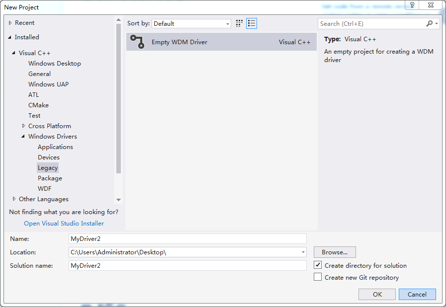

如果说机器性能不好，只能用VS2008或更低版本，那么安装一个VirtualDDK或DDKWizard是个不错的选择，它们也可以直接创建VS中直接编译的工程。如下两个图所示，在创建Project中就有了VisualDDK选项，选中后在驱动模型中还可以选择传统的NT驱动和WDM驱动。

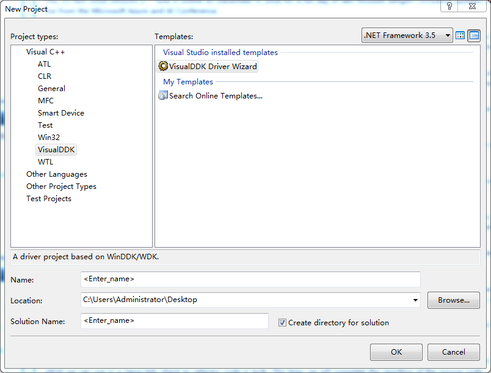
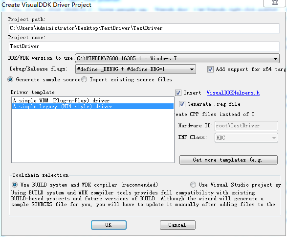

如果更简单的方式，则是编写makefile，sources，dirs文件，直接使用WDK提供的编译命令行运行build命令进行编译了。如图5为`WDK7600`中提供的编译命令行环境。


其他的就不再详细说了，其实这些编译方式最终都要使用`cl.exe`和`link.exe`进行编译链接；而这些使用VS建立工程的方式（高版本VS除外）最终也是使用`nmake`的方式建立工程，编译时一样需要运行`build`命令解析sources文件进行编译。这里以编写sources文件的方式来编译，如下编写makefile和sources两个文件。

```
// makefile
!INCLUDE $(NTMAKEENV)/makefile.def
```

```
// sources
TARGETNAME=HelloDDK
TARGETTYPE=DRIVER
TARGETPATH=OBJ

INCLUDES=$(BASEDIR)\inc; \
		 $(BASEDIR)\inc\ddk;\

SOURCES=Driver.cpp\
```

将`.h`和`.cpp`两个文件和这两个编译文件放在同一目录，然后启动前面的`WDK7600`中的任一编译命令行，运行`build`命令即可，在源码目录下即可看到编译产生的SYS文件。

> 这里提供一下DDKWizard和VisualDDK的下载地址。`DDKWizard`的下载地址[https://bitbucket.org/assarbad/ddkwizard/overview](https://bitbucket.org/assarbad/ddkwizard/overview)；下载`VisualDDK`的地址[http://visualddk.sysprogs.org/](http://visualddk.sysprogs.org/)。这两个创建驱动工程的方法类似，DDKWizard后期已经不再维护，而VisualDDK依然在维护，并且它对新的VS编译器（未添加驱动模板版本）支持也比较好。

**NT式驱动安装**

安装NT式驱动也有很多种方式，但是每一种方式最终都是要通过服务控制器SCM（Service Contrl Manager）来完成。

首先可以通过服务控制命令来完成NT驱动加载，即`sc`命令，该命令用于与服务控制器和服务进行通信。详细的命令说明可以从命令行中查看它的帮助。如下命令依次可以完成NT驱动的注册，启动，停止与删除功能。

```
// 创建服务，添加注册表（注意binpath=和type=后面的空格都是必须的）
sc create test binpath= C:\User\Administrator\Desktop\test.sys type= kernel

// 启动服务
net start test

// 停止服务
net stop test

// 删除服务
sc delete test
```

> 在Windows NT中，`sc`和`net`两个命令都可以访问服务管理器，它们的区别在什么地方呢？
> 1. net命令比较老，来自于MS-DOS和OS/2那时候，sc是随着NT的诞生出现的。
> 2. net仅仅能够启动，停止和暂停服务；sc具有更多高级功能，可以查询状态，创建和删除服务，修改配置等。
> 3. net仅仅用于本机，而sc命令可以跨网络使用，它命令中有`<server>`选项可以指定主机。
> 4. net接受服务显示名字作为命令参数，而sc通常使用服务名字（非显示名字）作为参数。
> 5. sc执行start和stop命令后，并不等待完成；而net执行start和stop命令时等待完成。所以有时用脚本自动执行stop然后执行start，sc容易造成在停止后不能启动问题。

其次可以使用网上已有的驱动安装程序来安装NT驱动，比如`KMDM.exe`(Kernel Mode Driver Manager)，`InstDrv.exe`（驱动加载工具），`DriverMonitor`等。这些工具就不一一解释用法了，启动程序看到了界面也就自然知道如何操作了。

最后还可以自己编写程序来加载驱动。前面说过加载NT驱动是通过创建服务来完成，而服务都是由服务控制器管理，所以可以通过调用服务管理器接口来完成服务的创建，启动，停止以及删除等动作（其实前面说的这些驱动加载器也是通过调用服务管理器接口来完成的服务的加载）。如下为编写驱动加载器要用到的几个服务相关接口。

```
// 打开服务控制管理器
SC_HANDLE OpenSCManager(
  LPCTSTR lpMachineName,   // 机器名称.可以制定计算机,如不指定,给NULL则是打开自己.
  LPCTSTR lpDatabaseName,  // 打开设备管理器数据库的名称,如果为NULL则使用默认的.
  DWORD dwDesiredAccess    // 打开的权限.
);

// 创建服务
SC_HANDLE CreateService(
  SC_HANDLE hSCManager,       // 设备管理器句柄,通过OpenScManger返回
  LPCTSTR lpServiceName,      // 服务或者设备启动的名称
  LPCTSTR lpDisplayName,      // 服务或者的显示名称
  DWORD dwDesiredAccess,      // 访问服务或者设备的权限
  DWORD dwServiceType,        // 创建的服务或者设备的类型,如果是内核驱动,则通过这里给
  DWORD dwStartType,          // 服务或者设备何时启动
  DWORD dwErrorControl,       // 服务或者设备启动出错时应用程序处理方式(重启,或者重新长还是.)
  LPCTSTR lpBinaryPathName,   // 服务或者设备的文件路径,必须给.
  LPCTSTR lpLoadOrderGroup,   // 服务或者设备排租.
  LPDWORD lpdwTagId,          // 可以通过注册表来启动服务.
  LPCTSTR lpDependencies,     // array of dependency names
  LPCTSTR lpServiceStartName, // 服务的启动名称.
  LPCTSTR lpPassword          // 密码
);

// 打开服务
SC_HANDLE OpenService(
  SC_HANDLE hSCManager,  // 设备管理器的句柄,通过OpenScManger返回.
  LPCTSTR lpServiceName, // 服务或者设备的名称.
  DWORD dwDesiredAccess  // 打开服务或者设备的权限.
);

// 启动服务
BOOL StartService(
  SC_HANDLE hService,            // 服务或者设备句柄
  DWORD dwNumServiceArgs,        // 二维数组的个数.
  LPCTSTR* lpServiceArgVectors   // 二维数组.其中每组存储一个服务名称.如果是内核驱动则都给NULL即可.
);

// 控制服务
BOOL ControlService(
  SC_HANDLE hService,               // 服务或者设备句柄,通过OpenService或者CreateService返回.
  DWORD dwControl,                  // 控制代码. 如果给SERVICE_CONTROL_PAUSE那么服务就会暂停
  LPSERVICE_STATUS lpServiceStatus  // 服务的状态.是一个结构体,操作系统帮你填好.
);

// 关闭服务句柄
BOOL CloseServiceHandle(
  SC_HANDLE hSCObject   // 服务或者设备的句柄
);

// 删除服务
BOOL DeleteService(SC_HANDLE hService); // handle to service
```

通过这些函数就基本可以编写一个NT驱动加载程序了。

**运行NT驱动**

NT式驱动虽然作为一个服务进行加载，其实它是由`I/O`管理器子系统负责加载的，即`I/O`管理器创建驱动对象，然后用驱动对象做参数调用驱动的入口函数`DriverEntry`。NT驱动在`DriverEntry`函数中创建设备对象，同时还会给驱动对象设置分发函数，用于响应应用层对驱动的请求。

驱动的设备对象由驱动对象结构体中的`DeivceObject`字段指向，一个驱动对应只有一个驱动对象，它可以创建多个设备对象，设备对象之间由设备对象结构体的`NextDevice`字段形成链表，这样形成的是设备对象的水平结构。设备对象创建时设置名字，大多以`\Device\XXXXXX`形式的命名，要在应用层访问驱动无法直接使用设备名，需要为设备对象设置一个符号链接，符号链接都是以`\??\YYYY`或`\DosDevices\YYYY`或`\Global??\YYYY`形式命名。在用户层则需要以`\\.\YYYY`或`\\.\Global\YYYY`形式来打开驱动并使用句柄访问驱动。

> 其中`\DosDevices`其实是`\??`的符号链接，内核解析`\??`会被转换为`\Global??`。而用户层的访问方式中，`\\.\`其实就是`\\Global??`，而`\\.\Global`其实是`\\Global??`的符号链接。

符号链接其实是有很多缺点的，符号名字重名不好处理；再者符号链接也没办法对驱动类型和设备对象进行分类。使用设备接口就可以避免这些问题。

当用户层操作驱动时，比如读取驱动内容，操作进入内核后，由`I/O`管理器将操作转化为IRP包，IRP包会被分发到驱动的分发函数中进行处理（前面`DriverEntry`中设置的函数）。

当驱动卸载时，系统调用驱动的卸载函数，在卸载函数中删除符号链接，删除设备对象（需要遍历整个设备对象链，删除驱动创建的所有设备对象）。

使用前面说的`InstDrv.exe`程序来安装驱动，并运行起来后，系统中有如下一些信息可以体现驱动的存在。


在设备管理器中NT驱动都是隐藏起来了，需要在菜单中`查看`下拉后，勾选`显示隐藏的设备`，这时列表中可以显示出`非即插即用驱动程序`子项，从这个子项中可以找到我们的设备信息`HelloDDK`。

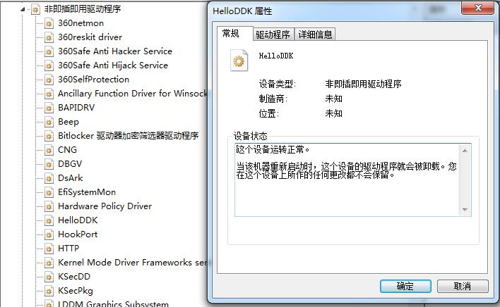

再就是`HelloDDK.sys`文件，它会被加载到系统的`System`进程中，使用`ProcXp.exe`程序就可以在该进程加载的模块中找到该文件。

> 直接从Windows驱动开发技术详解上Copy下来的代码有一点问题，就是`Unload`函数中会用到设备符号链接名删除注册的符号链接，而此时符号链接名的字符串所在内存已经无效。这是由于其中的函数被设置`INIT`代码块，`PAGE`代码块所导致，源代码中的写法，符号链接名字的字符串被编译进`INIT`代码块，一旦驱动初始化完毕就有可能将这块内存卸载，这就导致在驱动卸载需要用到这个字符串时出现访问非法，导致蓝屏。本文所用代码已修改！

###WDM驱动程序###

第一个WDM驱动程序例子的代码如下两个代码块所示，在后面对两个代码块做详细解释。

```
// Driver.h
#pragma once

#ifdef __cplusplus
extern "C" {
#endif

#include <wdm.h>

#ifdef __cplusplus
};
#endif

typedef struct _DEVICE_EXTENSION
{
	PDEVICE_OBJECT fdo;
	PDEVICE_OBJECT NextStackDevice;
	UNICODE_STRING ustrDeviceName;	// 设备名字
	UNICODE_STRING ustrSymLinkName;	// 符号链接
}DEVICE_EXTENSION, *PDEVICE_EXTENSION;

#define PAGECODE code_seg("PAGE")
#define LOCKEDCODE code_seg()
#define INITCODE code_seg("INIT")

#define PAGEDATA data_seg("PAGE")
#define LOCKEDDATA data_seg()
#define INITDATA data_seg("INIT")

#define arraysize(p) (sizeof(p)/sizeof((p)[0]))

NTSTATUS HelloWDMAddDevice(IN PDRIVER_OBJECT pDriverObject,
						   IN PDEVICE_OBJECT PhysicalDeviceObject);
NTSTATUS HelloWDMPnp(IN PDEVICE_OBJECT fdo,
					 IN PIRP pIrp);
NTSTATUS HelloWDMDispatchRoutine(IN PDEVICE_OBJECT fdo,
								 IN PIRP pIrp);
void HelloWDMUnload(IN PDRIVER_OBJECT pDriverObject);

extern "C"
NTSTATUS DriverEntry(IN PDRIVER_OBJECT pDriverObject,
					 IN PUNICODE_STRING pRegistryPath);
```

其实头文件`Driver.h`与NT式驱动程序类似，只是它包含的公共头文件变成了WDM驱动专用的`wdm.h`。

```
// Driver.cpp 文件
#include "Driver.h"

WCHAR *s_wstrDevName = L"\\Device\\MyWDMDevice";
WCHAR *s_wstrDevSymLinkName = L"\\DosDevices\\HelloWDM";

#pragma INITCODE
extern "C" NTSTATUS DriverEntry(IN PDRIVER_OBJECT pDriverObject,
								IN PUNICODE_STRING pRegistryPath)
{
	KdPrint(("Enter DriverEntry\n"));

	pDriverObject->DriverExtension->AddDevice = HelloWDMAddDevice;
	pDriverObject->MajorFunction[IRP_MJ_PNP] = HelloWDMPnp;
	pDriverObject->MajorFunction[IRP_MJ_DEVICE_CONTROL] = 
	pDriverObject->MajorFunction[IRP_MJ_CREATE] = 
	pDriverObject->MajorFunction[IRP_MJ_READ] =
	pDriverObject->MajorFunction[IRP_MJ_WRITE] = HelloWDMDispatchRoutine;
	pDriverObject->DriverUnload = HelloWDMUnload;

	KdPrint(("Leave DriverEntry\n"));
	return STATUS_SUCCESS;
}

#pragma PAGEDCODE
NTSTATUS HelloWDMAddDevice(IN PDRIVER_OBJECT pDriverObject,
						   IN PDEVICE_OBJECT PhysicalDeviceObject)
{
	PAGED_CODE();
	KdPrint(("Enter HelloWDMAddDevice\n"));

	NTSTATUS status;
	PDEVICE_OBJECT fdo;
	UNICODE_STRING devName;
	RtlInitUnicodeString(&devName, s_wstrDevName);
	status = IoCreateDevice(pDriverObject,
		sizeof(DEVICE_EXTENSION),
		&(UNICODE_STRING)devName,
		FILE_DEVICE_UNKNOWN,
		0,
		FALSE,
		&fdo);
	if (!NT_SUCCESS(status))
		return status;

	PDEVICE_EXTENSION pdx = (PDEVICE_EXTENSION)fdo->DeviceExtension;
	pdx->fdo = fdo;
	pdx->NextStackDevice = IoAttachDeviceToDeviceStack(fdo, PhysicalDeviceObject);

	UNICODE_STRING symLinkName;
	RtlInitUnicodeString(&symLinkName, s_wstrDevSymLinkName);
	pdx->ustrDeviceName = devName;
	pdx->ustrSymLinkName = symLinkName;

	status = IoCreateSymbolicLink(&(UNICODE_STRING)symLinkName, &(UNICODE_STRING)devName);
	if (!NT_SUCCESS(status))
	{
		IoDeleteSymbolicLink(&pdx->ustrSymLinkName);
		status = IoCreateSymbolicLink(&symLinkName, &devName);
		if (!NT_SUCCESS(status))
		{
			return status;
		}
	}

	fdo->Flags |= DO_BUFFERED_IO | DO_POWER_PAGABLE;
	fdo->Flags &= ~ DO_DEVICE_INITIALIZING;
	KdPrint(("Leave HelloWDMAddDevice\n"));
	return status;
}


#pragma PAGEDCODE
NTSTATUS DefaultPnpHandler(PDEVICE_EXTENSION pdx, PIRP Irp)
{
	PAGED_CODE();
	KdPrint(("Enter DefaultPnpHandler\n"));
	IoSkipCurrentIrpStackLocation(Irp);
	KdPrint(("Leave DefaultPnpHandler\n"));
	return IoCallDriver(pdx->NextStackDevice, Irp);
}


#pragma PAGEDCODE
NTSTATUS HandleRemoveDevice(PDEVICE_EXTENSION pdx, PIRP Irp)
{
	PAGED_CODE();
	KdPrint(("Enter HandleRemoveDevice\n"));

	Irp->IoStatus.Status = STATUS_SUCCESS;
	NTSTATUS status = DefaultPnpHandler(pdx, Irp);
	IoDeleteSymbolicLink(&(UNICODE_STRING)pdx->ustrSymLinkName);

	if (pdx->NextStackDevice)
	{
		IoDetachDevice(pdx->NextStackDevice);
	}

	IoDeleteDevice(pdx->fdo);
	KdPrint(("Leave HandleRemoveDevice\n"));
	return STATUS_SUCCESS;
}


#pragma PAGEDCODE
NTSTATUS HelloWDMPnp(IN PDEVICE_OBJECT fdo,
					 IN PIRP pIrp)
{
	PAGED_CODE();
	KdPrint(("Enter HelloWDMPnp\n"));

	NTSTATUS status = STATUS_SUCCESS;
	PDEVICE_EXTENSION pdx = (PDEVICE_EXTENSION)fdo->DeviceExtension;
	PIO_STACK_LOCATION stack = IoGetCurrentIrpStackLocation(pIrp);
	static NTSTATUS (*fcntab[])(PDEVICE_EXTENSION pdx, PIRP pIrp) = 
	{
		DefaultPnpHandler,	//IRP_MN_START_DEVICE
		DefaultPnpHandler,	//IRP_MN_QUERY_REMOVE_DEVICE
		HandleRemoveDevice,	//IRP_MN_REMOVE_DEVICE
		DefaultPnpHandler,	//IRP_MN_CANCEL_REMOVE_DEVICE
		DefaultPnpHandler,	//IRP_MN_STOP_DEVICE
		DefaultPnpHandler,	//IRP_MN_QUERY_STOP_DEVICE
		DefaultPnpHandler,	//IRP_MN_CANCEL_STOP_DEVICE
		DefaultPnpHandler,	//IRP_MN_QUERY_DEVICE_RELATIONS
		DefaultPnpHandler,	//IRP_MN_QUERY_INTERFACE
		DefaultPnpHandler,	//IRP_MN_QUERY_CAPABILITIES
		DefaultPnpHandler,	//IRP_MN_QUERY_RESOURCES
		DefaultPnpHandler,	//IRP_MN_QUERY_RESOURCE_REQUIREMENTS
		DefaultPnpHandler,	//IRP_MN_QUERY_DEVICE_TEXT
		DefaultPnpHandler,	//IRP_MN_FILTER_RESOURCE_REQUIREMENTS
		DefaultPnpHandler,	//
		DefaultPnpHandler,	//IRP_MN_READ_CONFIG
		DefaultPnpHandler,	//IRP_MN_WRITE_CONFIG
		DefaultPnpHandler,	//IRP_MN_EJECT
		DefaultPnpHandler,	//IRP_MN_SET_LOCK
		DefaultPnpHandler,	//IRP_MN_QUERY_ID
		DefaultPnpHandler,	//IRP_MN_QUERY_PNP_DEVICE_STATE
		DefaultPnpHandler,	//IRP_MN_QUERY_BUS_INFORMATION
		DefaultPnpHandler,	//IRP_MN_DEVICE_USAGE_NOTIFICATION
		DefaultPnpHandler,	//IRP_MN_SURPRISE_REMOVAL
	};

	ULONG fcn = stack->MinorFunction;
	if (fcn >= arraysize(fcntab))
	{
		status = DefaultPnpHandler(pdx, pIrp);
		return status;
	}

#if _DBG
	static char * fcnname[] = 
	{
		"IRP_MN_START_DEVICE",
		"IRP_MN_QUERY_REMOVE_DEVICE",
		"IRP_MN_REMOVE_DEVICE",
		"IRP_MN_CANCEL_REMOVE_DEVICE",
		"IRP_MN_STOP_DEVICE",
		"IRP_MN_QUERY_STOP_DEVICE",
		"IRP_MN_CANCEL_STOP_DEVICE",
		"IRP_MN_QUERY_DEVICE_RELATIONS",
		"IRP_MN_QUERY_INTERFACE",
		"IRP_MN_QUERY_CAPABILITIES",
		"IRP_MN_QUERY_RESOURCES",
		"IRP_MN_QUERY_RESOURCE_REQUIREMENTS",
		"IRP_MN_QUERY_DEVICE_TEXT",
		"IRP_MN_FILTER_RESOURCE_REQUIREMENTS",
		"",
		"IRP_MN_READ_CONFIG",
		"IRP_MN_WRITE_CONFIG",
		"IRP_MN_EJECT",
		"IRP_MN_SET_LOCK",
		"IRP_MN_QUERY_ID",
		"IRP_MN_QUERY_PNP_DEVICE_STATE",
		"IRP_MN_QUERY_BUS_INFORMATION",
		"IRP_MN_DEVICE_USAGE_NOTIFICATION",
		"IRP_MN_SURPRISE_REMOVAL",
	};

	KdPrint(("PNP Request (%s)\n", fcnname[fcn]));
#endif

	status = (*fcntab[fcn])(pdx, pIrp);

	KdPrint(("LeaveHelloWDMPnp\n"));
	return status;
}

#pragma PAGEDCODE
NTSTATUS HelloWDMDispatchRoutine(IN PDEVICE_OBJECT fdo,
								 IN PIRP pIrp)
{
	PAGED_CODE();
	KdPrint(("Enter HelloWDMDispatchRoutine\n"));

	pIrp->IoStatus.Status = STATUS_SUCCESS;
	pIrp->IoStatus.Information = 0;
	IoCompleteRequest(pIrp, IO_NO_INCREMENT);
	KdPrint(("Leave HelloWDMDispatchRoutine\n"));
	return STATUS_SUCCESS;
}

#pragma PAGEDCODE
void HelloWDMUnload(IN PDRIVER_OBJECT pDriverObject)
{
	PAGED_CODE();
	KdPrint(("Enter HelloWDMUnload\n"));

	KdPrint(("Leave HelloWDMUnload\n"));
}
```

在WDM驱动程序入口函数中多了`AddDevice`回调函数设置，NT驱动中没有此回调函数，它的作用是创建设备对象，由PnP（即插即用）管理器负责调用。再者是`IRP_MJ_PNP`的IRP回调函数设置，该回调函数负责PnP的IRP处理，它也是NT式驱动与WDM驱动的区别之一。

函数`HelloWDMAddDevice`在入口函数中设置给了驱动扩展中的`AddDevice`域，它用于创建设备对象，前面知道NT式驱动在入口函数中创建设备对象，WDM驱动中需要注册`AddDevice`回调例程，即我们这里说的这个函数。该函数有两个参数，参数`PDRIVER_OBJECT pDriverObject`和入口函数的参数之一一样，由PnP管理器传递进来；参数`PDEVICE_OBJECT PhysicalDeviceObject`是PnP管理器传递进来的底层驱动设备对象，这个也是NT式驱动中没有的概念。

在`HelloWDMAddDevice`函数中有一个`PAGED_CODE()`，它是DDK提供的宏，在check版本有效，一旦该函数运行时所处的中断请求级别高于`APC_LEVEL`就会出现断言。这是用于确保代码使用可分页内存，否则可能出现问题。创建设备对象类似与NT式驱动，除了NT式驱动一样创建对象，创建符号链接外，还需要调用`IoAttachDeviceToDeviceStack`函数将此设备对象挂接在设备栈中。

函数`HelloWDMPnp`为WDM处理PnP的回调函数，`IRP_MJ_PNP`会细分为若干子类，当前就对`IRP_MN_REMOVE_DEVICE`做了特护处理，调用`HandleRemoveDevice`；其他的子类则调用默认的处理函数`DefaultPnpHandler`。在函数`HandleRemoveDevice`中完成了NT驱动中`DriverUnload`的逻辑，这里还多了一个逻辑是调用`IoDetachDevice`函数将当前的设备对象从底层设备对象中摘除。`DefaultPnpHandler`函数中只是简单调用`IoSkipCurrentIrpStackLocation`将当前`IRP`栈跳过，然后调用`IoCallDriver`将IRP传递给底层的设备对象处理。

函数`HelloWDMDispatchRoutine`和NT式驱动中类似，不再详述。驱动卸载例程`HelloWDMUnload`中工作被前面的函数简化了，所以在该函数中不需要再做什么工作。

**WDM驱动编译**

前面介绍了NT式驱动编译，WDM驱动编译与其类似，这里不再重复。

**WDM的INF文件**

WDM驱动是NT驱动的扩展，主要是针对开发硬件驱动而推出的。随着硬件越来越多，并且越来越复杂，早期硬件驱动安装都是手动安装，并由人工配置资源，这样系统中硬件驱动安装就变成了一项专业技能。为了方便硬件驱动程序安装，微软开发了WDM驱动模型，WDM并不是为方便硬件驱动开发而退出，WDM程序比较复杂，理解起来相比NT要困难，导致开发WDM驱动难度较大。当然了，如果具有NT式驱动编写基础，WDM硬件驱动也不是特别困难。编写硬件驱动最主要的是了解硬件规格，知道硬件的各种资源，比如内存，寄存器，中断，通过控制内存，寄存器和中断来驱动硬件。

WDM驱动程序安装需要一个INF文件，设备信息文件（`Device INformation File`）。每一个驱动包中必须博阿含一个INF文件，系统安装组件在安装设备时需要读取它，INF文件并非安装脚本，它是一个ASCII或Unicode文本文件，提供了设备和驱动信息，包括驱动文件，注册表条目，设备ID，catalog文件和版本信息等。不仅仅是在设备或驱动安装时需要INF，当用户请求驱动更新时牙需要INF文件。INF文件的内容和格式依赖于设备安装类别，设备安装类别是为了帮助设备安装，具有相同的安装和配置方式的设备被分为相同类别，设备安装类定义了类安装器和类辅助安装器，微软定义了大部分设备的安装类别，每一个类别都有GUID与之关联，具有`GUID_DEVCLASS_XXX`形式；如果设备不再这些系统提供类别内，可以自定义设备类别，具体内容可参考WDK中inf相关帮助文档。

`Win+R`中输入`inf`就可以定位到系统盘的`Windows\INF`目录，其中包含了系统安装的所有WDM驱动的INF文件。INF文件格式类似`ini`文件，分节区，每个节区中内容以`key=words`等形式的存在。下面简单介绍INF文件中常用内容。INF是由`Sections`，`Keyword`，`Value`等形式组成，如下为`Version`节的一个示例：
```
[version]
	Sinature="$Chicago$
    LayoutFile=filename.inf
```

在INF中系统定义的几个常见节区有如下几个：

```
[Version]          基本的版本信息，INF必须包含的节区，其中还需要有效的Signature条目
[SourceDisksNames] 如果文件包含[SourceDisksFiles]，则必须包含本节区，列举包含安装文件的磁盘名字
[SourceDisksFiles] 标识待安装文件在分发媒介上的位置，可以是当前磁盘
[ClassInstall32]   初始化设备安装类，在安装INF文件中必须包含。如果类别属于系统预定义的类别，则不需要该节区。
[ClassInstall32.Services] 用于添加服务，控制如何和何时将服务加载。
[DestinationDirs]  指定了节区中描述文件拷贝，删除或重命名的文件在磁盘上的位置。
[Manufacturer]     它基本上是一个内容表，每一个条目就是指定了Models节区，在这些Models节区中才有真正的安装节区
[DefaultInstall]   默认执行的节区，包含了指向其他节的指针，用户右键选择`Install`时默认执行的节区
[Strings]          描述上面节中用到的字符串，本地化的字符串
```

通常，每个生产厂商的信息位于INF的Models节区，该节区中指向的DDInstall节区包含了特定模型的细节信息。Models节区有如下的格式：

```
[models-section-name]
	device-description=install-section-name[,hw-id][,compatible-id...]
	[device-description=install-section-name[,hw-id][,compatible-id]...] ...
```

每一行代表一个设备生产商信息，而每一个设备商信息中可以指定一种设备ID，还可附加多个可以用同一驱动控制的额外的兼容设备ID。每一个`models-section-name`都需要在`[Manufacturer]`节中列举出来。在Win2003之后，Manufacturer节必须附带`ntia64`，`.ntamd64`等平台扩展。

`device-description`条目标识被安装的设备，可以以任何可打印字符串或Token（%strkey%）形式给出；`install-section-name`指定未修饰的INF安装节区名字，即DDInstall节。`hw-id`指定供应商定义的硬件ID字符串，用于标识一个设备。它用于PnP管理器匹配设备的INF文件。这个字符串有如下的一些格式，`enumerator\enumerator-specific-device-id`，比如`PCI\VEN_1011&DEV_002&SUBSYS_00000000&REV_02`；`*enumerator-specific-device-id`，比如`*PNP0F01`表示微软串口鼠标，或者`SERENUM\PNP0F01`；`device-class-specific-ID`等形式。

WDK文档中给出了编写INF的建议，为驱动编写INF文件最好的方式是修改WDK中提供的例子中的INF文件，大部分WDK例子驱动中包含了INF文件。写完的INF文件，可以使用`ChkINF`程序（在WDK的开始菜单中有选项）进行校验，简单是否有错误。

INF中常见的集中操作如下所示：

```
LogConfig       Log日志文件配置
Copyfiles       复制文件
Renfiles        文件改名
Delfiles        删除文件
UpdateInis      更新Ini文件
UpdateIniFields 更新Ini字段
AddReg          添加注册项
DelReg          删除注册项
Ini2Reg         Ini文件转换为Reg文件
ADDSERVICE      添加服务
```

INF文件编写有一些规则如下，用于修改INF文件时遵守，防止出现错误。

1. INF文件是分节的，每一个INF由许多节组成，节名用方括号括起来，节名有些为系统定义，有些为自定义，每个节名最长255，节与节之间没有先后顺序区别。对于同一个INF文件中如果出现两个同样的节名，则系统会自动将两个节名下面内容合并到一起。
2. 在节与节之间的内容叫条目，每一个节又是由许多的条目组成，每一个条目都是`Key=Value`形式组成，Value有多个值时用逗号（英文形式）分隔。
3. INF文件对大小写不敏感。
4. “;”号后面的内容为注释。
5. 如果一个条目内容过多，一行无法写完，可以使用连行符号`\`写为多行。

如下给出一个安装WDM驱动的详细的INF文件内容，以及对应注释：

```
;INF是Device INformation File英文缩写，微软公司为硬件设备制造商发布其驱动程序推出的一种文件格式，
;INF文件中包含了硬件设备的信息或脚本以控制硬件操作。INF文件中指明了硬件驱动该如何安装到系统中，
;源文件在哪里，安装到那个文件夹中，怎样在注册表中加入驱动相关信息等。
;
;   有一种使用[DefaultInstall]节区的INF文件，它默认使用`%SystemRoot%\System32\InfDefaultInstall.exe`程序
;进行解析，它可以用于选中INF文件，右键->"安装"这种方式调用前面的程序解析INF，执行一些操作
;   对于WDM驱动安装不能使用这种节区，要使用[ClassInstall32]安装类别信息，并安装相应的驱动程序。
;
;---------------------版本信息-------------------------------
[Version]
Signature="$CHICAGO$"		; INF文件签名，一般为$Windows NT$ 或 $CHICAGO$，用于INF合法性判断
Provider="Zhangfan_Device"	; INF文件的供应商
DriverVer=11/01/2007,3,0,0,0	; 格式为 月/日/年[,x,y,v,z],点分的四位版本号（同PE的版本号形式）

; 设置设备类别。如果是一个标准类别，使用标准类的名称和GUID
; 否则创建一个自定义的类别名称，并自定义它的GUID
Class=ZhangfanDevice        ; 驱动程序所属的类别
ClassGUID={83C04128-CFD4-485e-86CB-BACE0ABFBF4E}  ; 设备类的GUID，与Class字段一一对应

;LayoutFile=XXXX            ; 仅供操作系统内部提供的INF文件使用
;CatalogFile=XXXX           ; 指明数字签名文件的文件名，其扩展名为.cat

;---------------------安装磁盘节--------------------------------
; 这些节去顶安装盘和安装文件的路径
; 这些路径可以根据需要进行修改
[SourceDisksNames]
; 指明设备驱动程序所在的磁盘或CD-ROM
; Win2000之后的格式 diskid=disk-description[,[tag-or-cab-file][,unused,path]]
; 其中diskid指出磁盘驱动器编号，为正整型数，通常从1开始，不能重复
; disk-description 表示磁盘描述信息，通常为字符串或token(%strkey%)。用于描述diskid标识磁盘的作用
; tag-or-cab-file 可选值，指出磁盘标签文件的文件名，tag文件用于校验安装磁盘。
; unused保留未用，path指出驱动程序所在路径，[]表示可选参数
1 = "HelloWDM",Disk1,,

[SourceDisksFiles]
; 指明设备驱动程序的文件名
; filename=diskid[,[subdir][,size]]
; filename 指出驱动程序的文件名，diskid指出磁盘驱动器编号，subdir指出文件在磁盘上的路径
; size 指出该文件未经过压缩时的大小，单位为字节
HelloWDM.sys = 1,,

;-----------------ClassInstall1/ClassInstall32 Section---------------
; 如果使用标准类别，下面这些不需要指定

; 9x Style
[ClassInstall]
Addreg=Class_AddReg

; NT Style
[ClassInstall32]
Addreg=Class_AddReg

[Class_AddReg]
; 添加注册表键值
; reg-root, [subkey], [value-entry-name], [flags], [value]

; reg-root 根键 HKR代表驱动所用注册表子目录中的根

; subkey   子健名称

; value-entry-name 条目名称

; flags 可选十六进制值，定义value-entry的类型

; value 对应条目的值
HKR,,,,%DeviceClassName%
HKR,,Icon,,"-5"

;--------------------目标文件节--------------------------------
[DestinationDirs]
; 指明INF文件和设备驱动程序的目标目录，INF中具有CopyFiles，DelFiles，RenFiles等指令时必须包含该节
; DefaultDestDir=dirid[,subdir]
; file-list-section=dirid[,subdir]
; DefaultDestDir是一个项名称，代表文件复制，删除重命名等操作目标目录
; file-list-section指出CopyFiles,DelFiles,RenFiles指令所引用的节
; dirid指出目标目录值，subdir指出dirid目录下的子目录
; dirid:
; 10 Windows目录，%windir% 11 系统目录%windir%/system32
; 12 驱动目录%windir%/system32/drivers
; 17 INF目录   18 帮助目录  20 字体目录  24 应用程序目录
; 50 %windir%/system   54  ntldr.exe和osloader.exe所在目录
YouMark_Files_Driver = 10,System32\Drivers

;--------------------制造商节----------------------------------
[Manufacturer]
; 指明供应商以及Models节的名称 %strkey%=models-section-name
; strkey 代表设备制造的名字，String节中定义，
; models-section-name 指出Models节名称
%MfgName%=Mfg0

[Mfg0]
; Models节指明Install/DDInstall节名称，设备硬件ID和兼容ID信息
; device-description=install-section-name,hw-id[,compatible-id]
; device-description 指出设备的表述星系，可以为字符串，也可以用%strkey%
; install-section-name指出Install/DDInstall节名称，hw-id指出硬件设备ID
; compatible-id指出设备的兼容ID
; 在这里描述PCI的VendorID和ProductID
; PCI\VEN_aaaa&DEV_bbb&SUBSYS_CCCCCCCC&REV_dd
; 改成自己的ID
%DeviceDesc%=YouMark_DDI,PCI\VEN_9999&DEV_9999

;----------------------DDInstall Sections-----------------------
; 如果在DDInstall中的字符串超过19，可能会导致问题

[YouMark_DDI]
CopyFiles=YouMark_Files_Driver
AddReg=YouMark_9x_AddReg

[YouMark_9x_AddReg]
HKR,,DevLoader,,*ntkern
HKR,,NTMPDriver,,HelloWDM.sys
HKR, "Parameters", "BreakOnEntry", 0x00010001, 0

;--------------------Windows NT------------------------
[YouMark_DDI.NT]
; 指明需要复制文件，注册表添加信息，节名称由Models节指定，如下为包含的常用项
; CopyFiles 指明需要复制的文件 CopyFiles=@filename|file-list-section[,file-list-section]...
; AddReg 指明添加注册表内容  AddReg=add-register-section[,add-register-section,]...
; Include 安装时需要的其他的INF文件 Include=filename.inf[,filename2.inf]...
; Needs 安装时需要的其他的INF文件 Needs=filename.inf[,filename2.inf]...
; Delfiles 指明需要删除文件
; RenFiles 指明要重命名文件
; DelReg指明需要删除注册表
CopyFiles=YouMark_Files_Driver
AddReg=YouMark_NT_AddReg

[YouMark_DDI.NT.Services]
; 指明驱动程序安装的详细信息，用于Win2000之后，节名为[install-section-name.Services]
; install-section-name 由 Models节指定
; AddService 控制驱动程序的安装过程 AddService=ServiceName,[flags],service-install-section,
; [,event-log-install-section[,[EventLogType][,EventName]]]...
; DelService 删除一个或多个已有驱动程序 DelService=ServiceName[,[flags][,[EventLogType][,EventName]]]...
; Include 指明安装所需要的其他INF文件
; Needs指明安装所需的特定INF文件
Addservice=HelloWDM,0x00000002,YouMark_AddService

[YouMark_AddService]
DisplayName=%SvcDesc%
ServiceType=1			; SERVICE_KERNEL_DRIVER
StartType = 3			; SERVICE_DEMAND_START
ErrorControl = 1        ; SERVICE_ERROR_NORMAL
ServiceBinary = %10%\System32\Drivers\HelloWDM.sys

[YouMark_NT_AddReg]
; 添加注册表内容 reg-root,[subkey],[value-entry-name],[flags],[value]
; reg-root 包含 HKCR（HKEY_CLASSES_ROOT），HKCU（HKEY_CURRENT_USER），HKLM（HKEY_LOCAL_MACHINE）
; HKU（HKEY_USER），HKR（被安装设备的注册表键）
; subkey 指出reg-root下的子目录或子健
; value-entry-name 指出要增加的注册表值
; flags 指出注册表的一些处理方法
; value 指出新增注册表值的数据
HKLM,"System\CurrentControlSet\Services\HelloWDM\Parameter","BreakOnEntry", 0x00010001,0

;-------------------文件节-----------------------------
[YouMark_Files_Driver]
HelloWDM.sys

;-------------------字符串节---------------------------
[Strings]
; 指明一些字符串，包含项格式为strkey=["]some string["]
ProviderName="Zhangfan"
MfgName="Zhangfan Soft"
DeviceDesc="Hello World WDM!"
DeviceClassName="Zhangfan_Device"
SvcDesc="Zhangfan"
```

常见的设备类别以及GUId值如下表所示：

| Class   |   ClassGuid                          |   说明      |
|---------|--------------------------------------|-------------|
| 1394    | 6BDD1FC1-810F-11D0-BEC7-08002BE2092F | 1394主控制器 |
| CDROM   | 4D36E965-E325-11CE-BFC1-08002BE10318 | CD-ROM驱动器 |
| DiskDrive|4D36E967-E325-11CE-BFC1-08002BE10318 | 磁盘驱动器    |
| Display | 4D36E968-E325-11CE-BFC1-08002BE10318 | 显示适配器    |
| FDC     | 4D36E969-E325-11CE-BFC1-08002BE10318 | 软盘驱动器    |
| HDC     | 4D36E96A-E325-11CE-BFC1-08002BE10318 | 硬盘控制器    |
| HIDClass| 745a17a0-74d3-11d0-b6fe-00a0c90f57da | 人机接口设备  |
| Keyboard| 4D36E96B-E325-11CE-BFC1-08002BE10318 | 键盘         |
| Modem   | 4d36e96c-e325-11ce-bfc1-08002be10318 | 调制解调器    |
| Monitor | 4d36e96e-e325-11ce-bfc1-08002be10318 | 监视器       |
| Mouse   | 4d36e96f-e325-11ce-bfc1-08002be10318 | 鼠标         |
| Net     | 4d36e972-e325-11ce-bfc1-08002be10318 | 网络适配器    |
| Ports   | 4d36e978-e325-11ce-bfc1-08002be10318 | 端口（COM）  |
| Printer | 4d36e979-e325-11ce-bfc1-08002be10318 | 打印机       |
| System  | 4d36e97d-e325-11ce-bfc1-08002be10318 | 系统设备      |
| TapeDrive|6D807884-7D21-11CF-801C-08002BE10318 | 磁带驱动器    |
| USB     | 36FC9E60-C465-11CF-8056-444553540000 | USB         |

现在INF编写完成，在安装驱动过程中，首先检查`[Version]`节中的签名信息，如果签名信息完整，则查找安装节，对于WDM驱动则是找类安装节，即`[ClassInstall32]`，这个节中会指定安装驱动中需要添加的一些信息。指明了类信息后就需要指定设备的制造商，即`[Manuafacturer]`节，其下每一行就描述了一个设备信息，其中包括安装节，设备ID号，也可以添加兼容设备的ID；这样当物理设备接入后，就可以获取设备ID，根据设备ID找到它对应的INF文件，从设备制造商节中的安装节就可以获取对应的驱动的安装节了，进一步安装硬件的驱动即可。

**WDM驱动安装**

安装WDM驱动需要INF文件，上面一小节介绍了INF的编写。有了INF文件，可以使用系统的设备管理器来安装WDM驱动程序。首先从我的电脑右键快捷方式中打开“管理”程序，然后在设备管理器中`XX-PC`上右键，选择“添加过时硬件”，如图8所示。

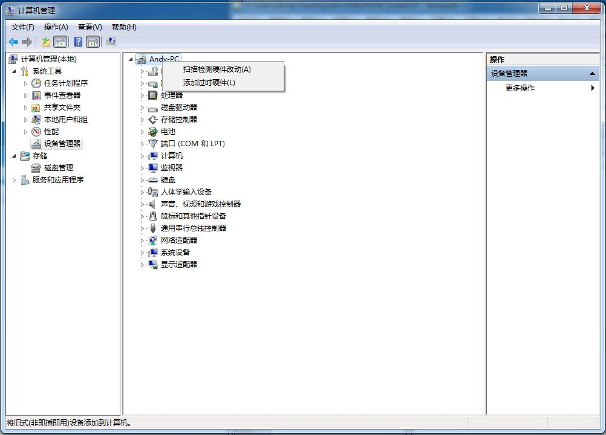

然后选择从`安装我手动从列表选择的硬件（高级）（M）`，如图9所示，然后继续下一步。

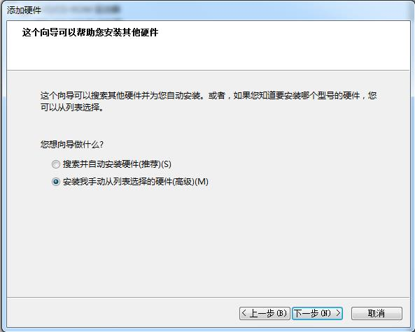

选择`从磁盘安装（H）...`，然后弹窗中选择INF文件路径确定即可，持续下一步。

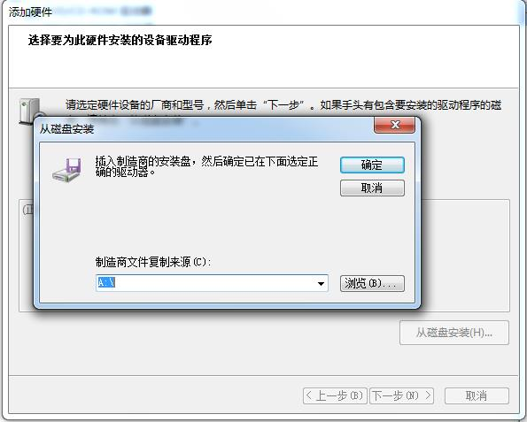

在安装过程中会弹窗提示驱动程序无法验证发布者，如图11所示，选择`使用安装此驱动程序软件(I)`即可。

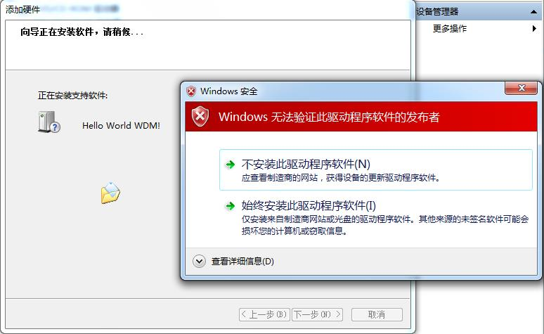

WDM驱动程序也可以使用工具进行安装，使用`EzDriverInstaller`程序安装WDM驱动界面如下图12中所示，打开INF文件，然后`Add New Device`就可以自动安装上WDM驱动了，这样就不需要从设备管理器中一步一步点击安装了，省事！

**WDM驱动运行**

WDM驱动程序与NT类似，不同点在于驱动扩展中的`AddDevice`函数。WDM驱动支持即插即用，需要提供一个`AddDevice`函数，在设备接入系统时由`I/O`管理器调用该函数创建硬件的功能设备对象（FDO）。

在WDM中不同于NT的是需要将WDM式的功能驱动挂接到物理设备对象。这样从应用层到底层硬件之间就形成了`硬件->物理设备对象->功能设备对象->应用层`，形成了上下的垂直结构。如下图11所示，加上功能设备对象上下的过滤驱动可以形成一层完整的WDM驱动垂直结构。

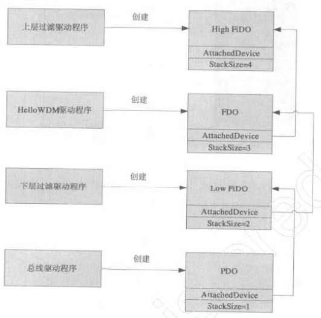

使用`EzDriverInstaller`安装完后的效果如图13所示。其中设备类为`Zhangfan_Device`即INF中的`Class`字段内容，依次还可以看到其他的内容与INF中各节的对应信息。

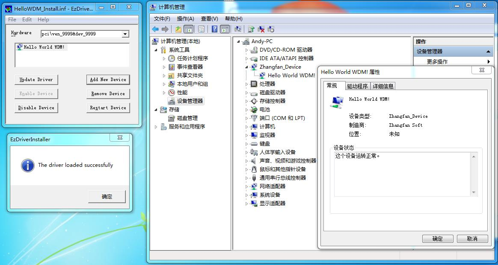

比如驱动信息中具有驱动版本（其中带有日期），还有就是驱动提供商等信息，都列举在如下图14中的驱动程序一栏中。

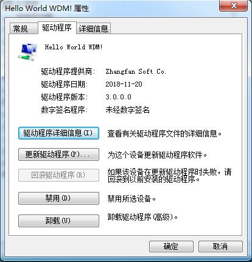

INF信息最终都会进入注册表进行保存，如下几个子目录中几乎保存了INF中驱动相关的信息，如下图15，16，17。在每个图中下方都有它们所在子目录的完整路径。

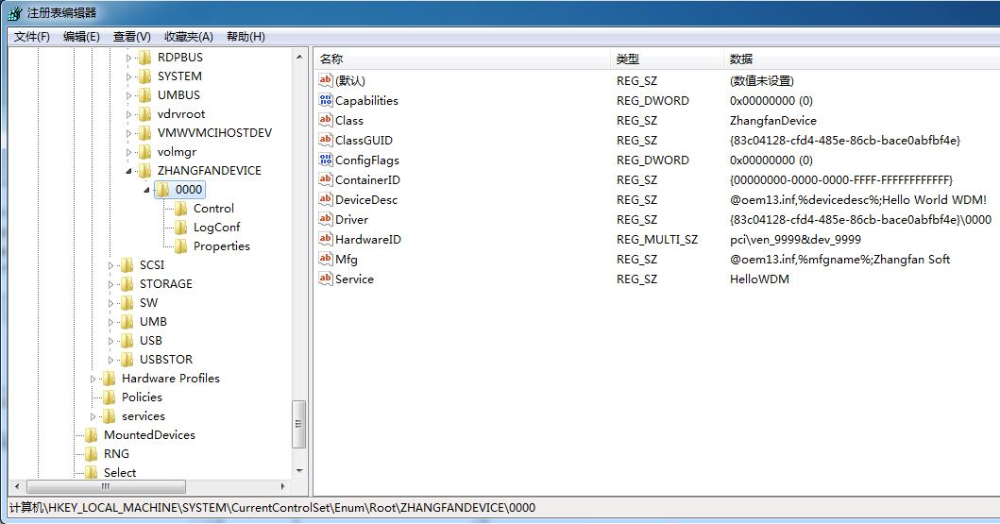

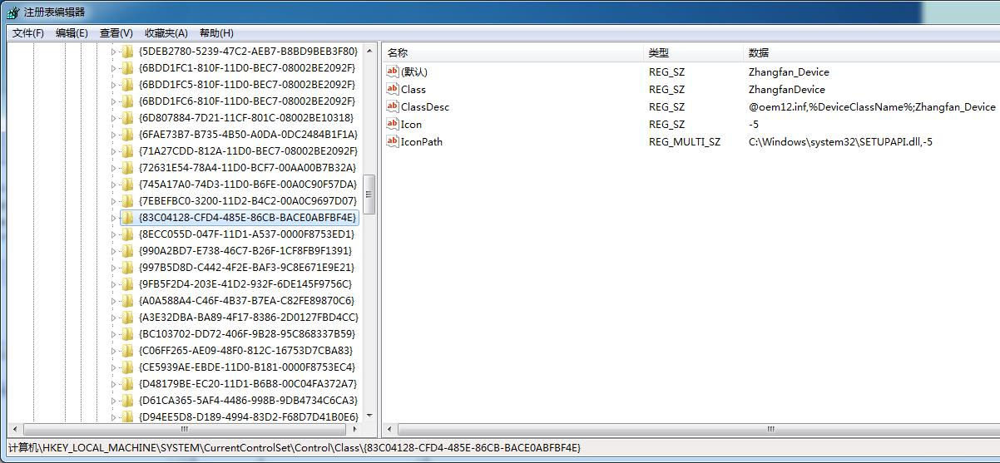

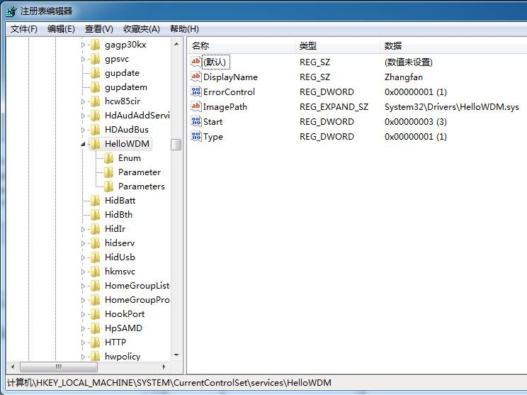

###WDF驱动程序###

待添加

###驱动调试###

**断点设置**

如果要调试驱动，则需要在驱动入口处设置断点。使用内联汇编`__asm{int 3;}`可以实现在代码中加入断点。要实现X86和X64统一，最好使用`KdBreakPoint()`来在代码中设置断点，这具有通用性（X64不支持内联汇编）。

**调试信息**

在WinXP及之前的系统中内核提供的是`DbgPrint`函数，这个函数类似`printf`直接输出调试信息。而在Vista及之后，调试信息很多，那就需要对调试信息进行分类，系统增加了调试输出的Filter机制（`Component Id + Message Level`）。在新的系统中就提供了`DbgPrintEx`函数，它除了`DbgPrint`函数的原有参数外，额外提供了`ULONG ComponentId`和`ULONG Level`两个参数。

提供了`DbgPrintEx`之后，原有的`DbgPrint`其实就变成了它的一个特例，下面以一种宏定义的形式来说明一下（实际实现并非宏定义）。即`DbgPrint`相当于`DbgPrintEx`的前两个参数为默认的`DPFLTR_DEFAULT_ID`和`DPFLTR_INFO_LEVEL`。

```
#define DbgPrint DbgPrintEx ( DPFLTR_DEFAULT_ID, DPFLTR_INFO_LEVEL, Format, arguments )
```

这里面其实有一个问题，在Vista之后一旦分了调试信息输出等级后，系统默认的调试输出级别被设置为`DPFLTR_ERROR_LEVEL`，即之后错误级别的调试信息才能输出，其他的调试信息都是不输出的（一共分为错误，警告，追踪和信息四个级别）。所以在XP上的驱动源码重新编译放到Vista及之后系统上时，调试信息输出不出来。

要修改这块信息有两种方法，一种是挂内核调试器，修改内核的一个全局变量`nt!kd_default_musk`，将它的值修改为8（或大于8的值），即设置级别为INFO，这样修改可以立即生效，但是重启系统就失效了。另一种方法是修改注册表，如下所示。这种方法需要重启系统才能生效，并且将一直生效。

```
Windows Registry Editor Version 5.00

[HKEY_LOCAL_MACHINE\SYSTEM\CurrentControlSet\Control\Session Manager\Debug Print Filter]

"DEFAULT"=dword:0000000f
```

> DbgPrint和DbgPrintEx可以在`IRQL<=DIRQL`时使用，但是对于Unicode的输出`%wc`和`%ws`只能在`IRQL==PASSIVE_LEVEL`时使用。由于调试器使用IPI与其他进程通信，如果IRQL大于DIRQL会造成思索。>

**设备对象**

设备对象是系统定义的内核对象，它是驱动程序的通讯接口，系统模块或用户程序通过设备对象和驱动模块通信。按照设备对象的作用可以分为如下的集中类型：

1. 物理设备对象（PDO），对应真实/逻辑物理设备，由总线驱动创建，总是命名的。
2. 功能设备对象（FDO），功能驱动所创建，用来和总线驱动创建的PDO呼应，实现物理设备真正功能。
3. 过去设备对象（Filter DO），插入PDO-FDO主城的设备栈中，参与`I/O`命令处理。
4. 控制设备对象（Control DO），不对应真实/逻辑的物理设备。一般驱动程序只创建唯一控制设备对象，不用来实现具体的设备功能，而是用于驱动控制，它也总是命名的设备对象。


**参考文章**

1. 《Windows驱动开发技术详解》
2. [VS2013 WDK8.1驱动开发1](http://www.coderjie.com/blog/91a5722cdd2d11e6841d00163e0c0e36)
3. [Windows驱动inf文件详解](https://blog.csdn.net/u011191259/article/details/41963403)
By Andy@2018-11-15 09:48:52
