#驱动编程中的技巧#

###函数与类型查找###

WDK安装过程中会安装驱动编程的文档，这是微软提供的官方文档，所有的类型以及函数说明最终都要以它为准。所以有一些内容与其从网上或搜索引擎搜索，不如从这里查找。如下搜索驱动的入口函数`DriverEntry`，如图1所示。


当然了，微软的官方文档描述模糊，一些原理性内容写的罗哩罗嗦也是公认的问题，读不明白文档还是要去浩瀚的互联网上寻求大众的智慧^_^。

###内核支持函数搜索###

有时候有些函数只知道部分字段，但是想不起来完整的函数名字。或者说想要看看内核到底支持不支持想要实现的功能，可能用的比较多的是字符串处理。有时候盲目去搜索引擎搜索，可能会词不达意，导致搜索不到。其实内核编程中用的比较多的就是内核自身的导出函数，从其中搜索会更有针对性。

以最常用的内核模块`ntoskrnl.exe`为例，用`IDA`反编译内核模块`C:\Windows\System32\ntoskrnl.exe`模块，然后再`Exports`标签中搜索关键字即可找到对应的导出函数。比如查找`UNICODESTRING`相关的操作函数，如下图2。


###编写不同Windows版本上的驱动###

创建驱动工程可能会指定最小的目标操作系统，这意味着这个驱动运行的Windows系统的最低版本。要想写一个多个系统版本都能使用的驱动，那么在驱动中只能使用这些系统中都具有的功能。

要使用以来版本的功能，可以使用内核提供的确定Windows版本的函数先确定系统版本。

如下函数用于确定指定的版本在当前是否有效。比如参数Version传递`NTDDI_WIN8`，则表示当前系统是否支持这个版本，当当前系统的版本大于等于Win8时函数就返回TRUE。

```
BOOLEAN RtlIsNtDdiVersionAvailable(IN ULONG Version)
```

要检查特定的补丁包则可以使用如下函数，该函数只有Version值与系统匹配时才会返回TRUE。比如在`Windows Server 2008 with sp4`系统上，使用该函数传递`NTDDI_WS08SP3`参数则会返回失败。

```
BOOLEAN RtlIsServicePackVersionInstalled(IN ULONG Version)
```

对于驱动在系统版本满足时要调用高版本系统上才有的函数，可以使用`MmGetSystemRoutineAddress`函数来在条件满足时，获取要调用函数指针，通过函数指针间接调用，如下例子：

```
//
// Are we running on Windows 7 or later?
//
 if (RtlIsNtDdiVersionAvailable(NTDDI_WIN7) ) {

 //
  // Yes... Windows 7 or later it is!
  //
     RtlInitUnicodeString(&funcName,
                  L"KeAcquireInStackQueuedSpinLock");

 //
  // Get a pointer to Windows implementation
  // of KeAcquireInStackQueuedSpinLock into our
  // variable "AcquireInStackQueued"
     AcquireInStackQueued = (PAISQSL)
                  MmGetSystemRoutineAddress(&funcName);
 }

...
// Acquire a spin lock.

 if( NULL != AcquireInStackQueued) {
  (AcquireInStackQueued)(&SpinLock, &lockHandle);
} else {
    KeAcquireSpinLock(&SpinLock);
}
```


###设备节点与设备栈###

在 Windows 上，设备是由即插即用设备树上的设备节点表示。通常，当`I/O`请求发送到设备时，几个驱动一起帮助处理请求。每一个驱动都与一个设备对象相关联，设备对象之间被安排成一个栈的形式。设备对象以及它们相关联的驱动所组成的序列被称为设备栈，每个设备节点都有他自己的设备栈。

**设备节点和即插即用设备树**

Windows 以树结构组织设备，被称为即插即用设备树，或简单称为设备树。通常，设备树中的一个节点代表一个设备或者代表一个组合设备中的功能。但是另外一些节点表示软件组件，它们没有相关联的物理设备。

设备树中的一个节点被称为设备节点，设备树的根节点被称为根设备节点，如下图所示。按照习惯，根设备节点被绘制在设备树底部。

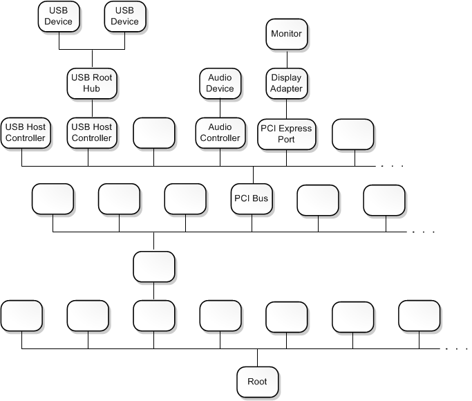

设备树说明了设备之间的父子关系，这种关系是即插即用环境中固有的关系。设备树中表示总线的几个节点有子设备连接到它们。例如，`PCI Bus` 节点表示主板上的物理 PCI 总线。在系统启动时，PnP管理器请求 PCI 总线驱动枚举连接到 PCI 总线的设备，这些设备由`PCI Bus`节点的子节点表示。在前面的图中，`PCI Bus` 节点有几个子节点，它们表示几种连接到`PCI`总线的设备，包括 USB主控制器，音频控制器和一个PCI Express端口。

连接到PCI 总线的设备是总线自己。PnP管理器请求这些总线枚举连接到它们的设备。在前面图中，可以看到音频控制器是一个总线，有一个音频设备连接到它上面。PCI Express 端口也是一个总线，视频卡连接到这个端口上，视频卡本身也是一个总线，有一个显示器连接到视频卡上。

**设备对象和设备栈**

设备对象是`DEVICE_OBJECT`结构体的一个实例。在即插即用设备树上的每个设备节点都有一个有序的设备对象列表，列表中的每个设备对象都与一个驱动相关联。设备对象的有序列表以及与设备对象关联的驱动被称为设备节点的设备栈。

对设备栈的结构想象可以有不同的方式。最正式的一种方式中，设备栈是一个（设备对象，驱动）对的有序列表。但是，在某些上下文中，将设备栈当作有序的设备对象序列会比较有助于理解；而在另外一些场景中，将设备栈当作驱动的有序列表会比较有用。

通常，设备栈有顶层和底层。在设备栈中创建的第一个设备对象是栈底，最后创建并且挂接到设备栈的设备对象是栈顶。在下面的图中，`Proseware Gizmo`设备节点有一个包含了（设备对象，驱动）对的设备栈。顶层设备对象与驱动`AfterThrought.sys`相关联，中间的设备对象与驱动`Proseware.sys`关联，底层设备对象与驱动`Pci.sys`相关联。在图中间的`PCI Bus`节点有一个包含了两个（设备对象，驱动）对的设备栈——设备对象与`Pci.sys`驱动关联，一个设备对象与`Acpi.sys`驱动关联。

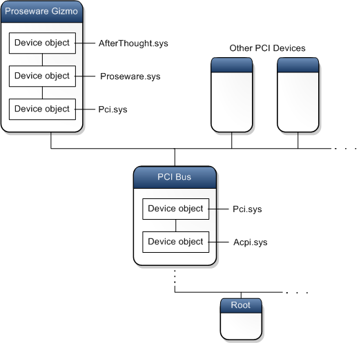

**设备栈如何构建**

在系统启动期间，即插即用管理器请求每个总线的驱动枚举连接到总线上的子设备。例如，即插即用管理器请求 PCI 总线驱动（Pci.sys）枚举连接到 PCI 总线上的设备。作为请求的回应，Pci.sys 为每一个连接到 PCI 总线的设备创建设备对象。这些设备对象被称为物理设备对象（PDO）。在 `Pci.sys` 创建了 PDO 集合之后，设备树看起来像如下的图所示的形式。

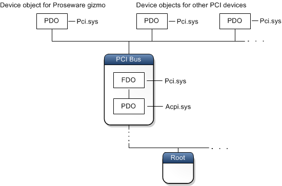

即插即用管理器将新创建的 PDO 与设备节点关联，并且在注册表中查找并确定那个驱动将作为这个设备节点的一部分加载。设备栈必须有（且仅有）一个功能驱动，可选地可以有一个或多个过滤驱动。功能驱动是设备栈的主驱动，负责处理读，写和设备控制等请求。过滤启动扮演着协助角色，用于预处理读，写和设备请求。当每个功能和过滤启动加载，它就会创建一个设备对象，并将自己挂到设备栈上。功能驱动创建的设备对象被称为功能设备对象（FDO)，过滤驱动创建的设备对象被称为过滤设备对象（Filter DO）。现在设备树会看起来如下图所示。

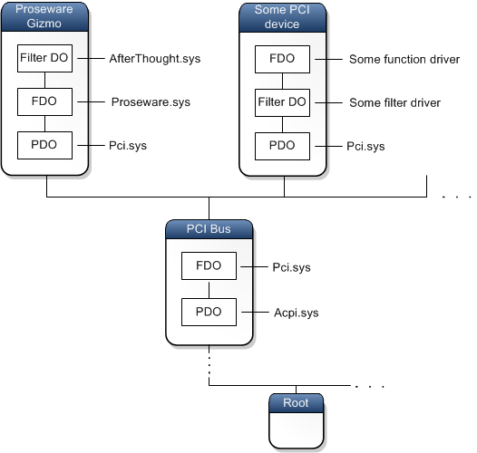

在图中，注意到一个设备节点中，过滤启动是在功能驱动上面，在另外一个设备节点中，过滤驱动在功能驱动下方。在设备栈中，如果过滤驱动在功能驱动上方被称为上部过滤驱动；如果过滤驱动位于功能驱动下方，则被称为下部过滤驱动。

PDO总是设备栈的底部设备对象，上述形式就是设备栈创建的方式。PDO首先创建，额外设备对象挂接到栈上，它们总是挂接到已存栈的顶部。

**总线驱动**

在前面的图中，可以发现 `Pci.sys` 扮演着两个角色。首先，`Pci.sys` 在 `PCI Bus` 设备节点中与 FDO 关联，实际上是它在 `PCI Bus` 设备节点中创建了 FDO。因此 `Pci.sys` 是 PCI 总线的功能驱动。再者，`Pci.sys` 在 `PCI Bus` 节点的子节点中都与一个 PDO相关联，回忆前面可知是它创建了子设备的 PDO。为设备节点创建 `PDO` 的驱动被称为该节点的总线驱动。

如果引用点在 PCI 总线，那么 `Pci.sys` 是功能驱动；但是如果引用点在 `Proseware Gizmo` 设备，那么`Pci.sys` 就是总线驱动。在即插即用设备树中这种双角色非常常见，即一个驱动即作为总线的功能驱动，同时也充当总线子设备的总线驱动。

**用户模式设备栈**

到目前为止讨论的是内核模式的设备栈，也就是说，设备栈中的驱动运行在内核模式，设备对象映射进系统地址空间（这个地址空间只对运行在内核模式的代码可用）。

在一些情况中，除了内核模式设备栈之外，设备还有用户模式设备栈。用户模式驱动通常是基于用户模式驱动框架（UMDF）构建，UMDF 是 Windows驱动框架（WDF）提供的一种驱动模型。在UMDF中，驱动是用户模式的 DLL，设备对象是实现了 IWDFDevice 接口的 COM 对象。UMDF设备栈中的设备对象被称为 WDF 设备对象（WDF DO）。

如下图给出了 `USB-FX-2`设备的设备节点，驱动模式设备栈和用户模式设备栈。用户模式和内核模式的设备栈的驱动都参与`I/O`请求。

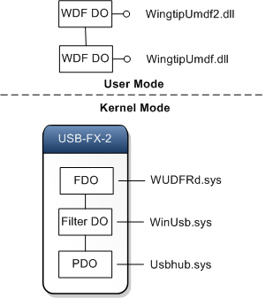

###I/O请求包（IRP）###

发送给设备驱动程序的大部分的请求都被打包成 `I/O` 请求包（IRP）。操作系统组件或驱动通过调用 `IoCallDriver` 函数发送 IRP 给驱动，这个函数有两个参数，一个指向`DEVICE_OBJECT`的指针和一个指向`IRP`的指针。`DEVICE_OBJECT`有一个指向关联`DRIVER_OBJECT`的指针。当组件调用`IoCallDriver`函数时，我们称给设备对象发送IRP或给驱动关联的设备对象发送IRP。有时我们使用属于传递 `IRP` 或转发 `IRP` 来代替发送 `IRP`。

通常，一个 `IRP` 由排列在设备栈中的几个驱动处理，设备栈中的每个驱动都关联一个设备对象。参考更多信息可以看`设备节点和设备栈`。当IRP被一个设备栈处理时，IRP 通常首先发送给设备栈上的定义设备对象。例如，如果一个IRP被途中的设备栈处理，IRP应该被首先发送给设备栈顶层的过滤设备对象（Filter DO)。

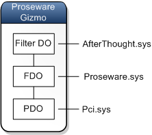

**将IRP向下传递到设备栈**

假设在图中 `I/O` 管理器发送 IRP 到 `Filter DO`。与 `Filter DO` 关联的驱动（AfterThought.sys）处理 IRP，然后将 IRP 传递给功能设备对象（FDO），FDO 是设备栈中低一层的设备对象。当驱动传递 IRP 给设备栈中低一层的设备对象时，我们称驱动将IRP传递给底层设备栈。

一些 IRP 一直顺着设备栈传递到物理设备对象（FDO）；另外一些 IRP 绝对不会达到 PDO，因为这些 IRP 都被 PDO 之上的一个驱动完成了。

**IRP是自包含的结构**

IRP 结构某种意义上是自包含的，它保存了驱动处理 `I/O` 请求所需的所有信息。IRP 结构中的一些部分保存了所有参与到设备栈的驱动都需要的信息；另外一部分则保存了设备栈中特定驱动所需要的信息。

###驱动栈###

大部分发送到设备的请求都打包进 IRP。每个设备都有一个设备节点表示，每个设备节点都有设备栈。更多详细信息参考`设备节点和设备栈`。发送一个读，写或控制请求到设备，`I/O`管理器查找设备的设备节点，然后发送 IRP 到这个节点的设备栈。有时在处理`I/O`请求时会涉及到多个设备栈。无论涉及到多少设备栈，参与`I/O`请求的驱动的整体顺序被称为请求的驱动栈。我们也使用属于驱动栈来指特定技术的驱动层级集合。

**几个设备栈处理I/O请求**

在一些情境中，处理一个 IRP 中会涉及多个设备栈。如下图说明了处理一个 IRP 中涉及四个设备栈的情况。

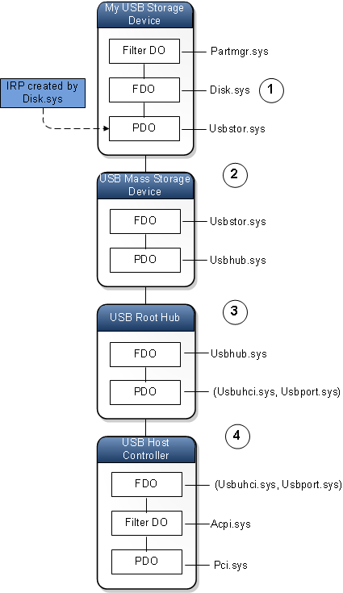

如下是在途中每个编号阶段 IRP 如何处理：

1. IRP 是由 `Disk.sys` 驱动创建，在`My USB Storage`节点中的设备栈中它是功能驱动。`Disk.sys`向下传递 IRP 给设备驱动栈中的 `Usbstor.sys`。
2. 注意到 `Usbstor.sys` 是`My USB Storage Device`节点的 PDO 驱动，以及 `USB Mass Storage Device` 节点的FDO驱动。在这点上，不需要去确定 IRP 由（PDO，Usbstor.sys）对持有还是由（FDO，Usbsto.sys）对持有。IRP 是由驱动 `Usbstor.sys` 持有，驱动可以访问 PDO 和 FDO。
3. 当 `Usbstor.sys` 完成了 IRP 的处理，它将 IRP 传递给 `Usbhub.sys`。`Usbhub.sys` 是 `USB Mass Storage Device` 节点的 PDO 驱动，以及 `USB Root Hub` 节点的驱动。在这点上，确定IRP是由（PDO，Usbhub.sys）持有还是由（FDO，Usbhub.sys）对持有并不重要。IRP是由驱动程序 Usbhub.sys 持有，驱动有权访问 PDO 和 FDO。
4. 当 Usbhub.sys 完成了 IRP 处理，它将IRP传递给（Usbuhci.sys,UsbPort.sys）驱动对。

	`Usbuhci.sys`是一个mini端口驱动，`UsbPort.sys`是一个端口驱动。（miniport，port）驱动对扮演了一个驱动的角色。在这种情况下，mini端口驱动和端口驱动都是由微软船舰。（Usbuhhi.sys，Usbport.sys)驱动对是`the USB Root Hub`的PDO驱动，同时也是`USB Host Controller`节点的功能驱动。（Usbuhhi.sys，Usbport.sys)驱动对实际上完成了与主机控制硬件之间的通信，主机控制器硬件完成了与物理 USB 存储设备的通信。

**I/O请求的驱动栈**

参考前面图里面参与到`I/O`请求的四个驱动顺序，可以得到另外一幅顺序视图，这幅图中我们仅将注意力集中到驱动，不再关注设备节点和它们的设备栈。如下图给出了从顶到底的驱动序列。注意，`Disk.sys`与一个设备对象相关联，但是其他的三个驱动都与两个设备对象相关联。

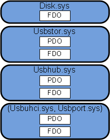

参与进`I/O`请求的驱动的顺序被称为`I/O`请求的驱动栈。为了说明一个`I/O`请求的驱动栈，我们按照驱动参与到请求的从顶到底顺序绘制了这幅图。

注意`I/O`请求的驱动栈与设备节点的设备栈不同。同时也得注意`I/O`请求的驱动栈并不必须保持在设备树的一个分支上。

**技术驱动栈**

考虑前面途中的`I/O`请求的驱动栈，如果我们给每个驱动一个友好的名字，对图做一些调整，那就可以得到如下的框图。这幅框图类似于 WDK 文档中出现的那些框图。


在图中，驱动栈被分为三个部分。我们将每一部分看作属于某个特定的技术，或属于特定组件，或操作系统某一部分。例如，从图中可以看到驱动栈的顶部属于卷管理器，第二部分属于操作系统的存储组件，第三部分属于操作系统的核心USB部分。

看第三部分中的驱动，这些驱动都是微软提供的用于处理各种USB请求和USB硬件的核心USB驱动的子集。如下图给出了USB核心框图的形式：


显示特定技术或特定组件或系统特定部分的所有驱动的框图被称为技术驱动栈。典型地，技术驱动栈会有类似USB核心驱动栈，存储栈，1394驱动栈和音频驱动栈。

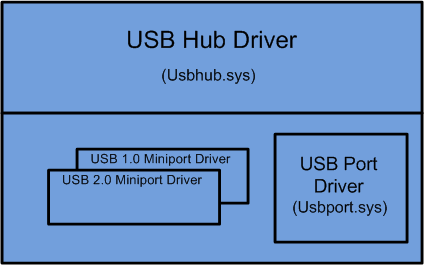

> 注：这个话题中的USB核心框图显示了几种说明USB 1.0和2.0技术驱动栈的方法之一。更多USB 1.0，2.0和3.0驱动栈的官方图可以参考`USB驱动栈架构`。

###Mini驱动，Mini端口驱动和驱动对###

mini驱动或mini端口驱动充当驱动对的一半，驱动对，例如（miniport，port）能够让驱动程序开发更简单。在驱动对中，一个驱动处理通用任务，这些任务通常对一整类设备集合都是通用的；但是另外一个驱动只处理特定于某个设备的任务。处理特定设备任务的驱动名字有多个，包括 `miniport` 驱动，`miniclass` 驱动和 `mini` 驱动。

微软提供了通用驱动，通常一个独立的硬件提供商会提供特定确定。在阅读这个话题之前，你应该理解在`设备节点和设备栈`以及`I/O请求包`两篇中的观点。

每个内核模式驱动必须实现一个名字为`DriverEntry`的函数，它在驱动加载后马上被调用。`DriverEntry` 函数使用指向驱动实现的几个函数来填充`DRIVER_OBJECT` 结构体的某些成员。例如`DriverEntry`函数使用驱动实现的`Unload()` 函数填充`DRIVER_OBJECT` 结构体的 `Unload` 成员，如下图所示：

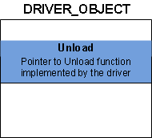

`DRIVER_OBJECT` 结构体的成员 `MajorFunction` 是一个指针数组，指向处理`I/O`请求包（IRP）的函数，如下图所示。通常，驱动会使用驱动实现的几个函数来填充 `MajorFunction` 数组中的成员，用来处理各种不同的`IRP`。

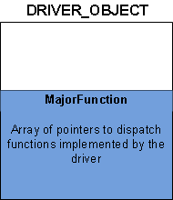

IRP 可以根据它的主函数码进行分类，函数码通常用一个常数标识，比如`IRP_MJ_READ`，`IRP_MJ_WRITE`或`IRP_MJ_PNP`。这个标识主函数码的常数可以作为 `MajorFunction` 数组的索引。例如，假设驱动程序实现了分发函数来处理主函数码为 `IRP`，那么驱动必须使用指向分发函数的指针填充数组的 `MajorFunction[IRP_MJ_WRITE]`元素。

通常，驱动会填充一部分 `MajorFunction` 数组的一部分元素，剩下的元素则设置为 `I/O`管理器提供的默认值。如下的例子显示了如何使用 `!drvobj` 调试器扩展来查看 `parport` 驱动的函数指针：

```
0: kd> !drvobj parport 2
Driver object (fffffa80048d9e70) is for:
 \Driver\Parport
DriverEntry:   fffff880065ea070 parport!GsDriverEntry
DriverStartIo: 00000000 
DriverUnload:  fffff880065e131c parport!PptUnload
AddDevice:     fffff880065d2008 parport!P5AddDevice

Dispatch routines:
[00] IRP_MJ_CREATE                      fffff880065d49d0    parport!PptDispatchCreateOpen
[01] IRP_MJ_CREATE_NAMED_PIPE           fffff80001b6ecd4    nt!IopInvalidDeviceRequest
[02] IRP_MJ_CLOSE                       fffff880065d4a78    parport!PptDispatchClose
[03] IRP_MJ_READ                        fffff880065d4bac    parport!PptDispatchRead
[04] IRP_MJ_WRITE                       fffff880065d4bac    parport!PptDispatchRead
[05] IRP_MJ_QUERY_INFORMATION           fffff880065d4c40    parport!PptDispatchQueryInformation
[06] IRP_MJ_SET_INFORMATION             fffff880065d4ce4    parport!PptDispatchSetInformation
[07] IRP_MJ_QUERY_EA                    fffff80001b6ecd4    nt!IopInvalidDeviceRequest
[08] IRP_MJ_SET_EA                      fffff80001b6ecd4    nt!IopInvalidDeviceRequest
[09] IRP_MJ_FLUSH_BUFFERS               fffff80001b6ecd4    nt!IopInvalidDeviceRequest
[0a] IRP_MJ_QUERY_VOLUME_INFORMATION    fffff80001b6ecd4    nt!IopInvalidDeviceRequest
[0b] IRP_MJ_SET_VOLUME_INFORMATION      fffff80001b6ecd4    nt!IopInvalidDeviceRequest
[0c] IRP_MJ_DIRECTORY_CONTROL           fffff80001b6ecd4    nt!IopInvalidDeviceRequest
[0d] IRP_MJ_FILE_SYSTEM_CONTROL         fffff80001b6ecd4    nt!IopInvalidDeviceRequest
[0e] IRP_MJ_DEVICE_CONTROL              fffff880065d4be8    parport!PptDispatchDeviceControl
[0f] IRP_MJ_INTERNAL_DEVICE_CONTROL     fffff880065d4c24    parport!PptDispatchInternalDeviceControl
[10] IRP_MJ_SHUTDOWN                    fffff80001b6ecd4    nt!IopInvalidDeviceRequest
[11] IRP_MJ_LOCK_CONTROL                fffff80001b6ecd4    nt!IopInvalidDeviceRequest
[12] IRP_MJ_CLEANUP                     fffff880065d4af4    parport!PptDispatchCleanup
[13] IRP_MJ_CREATE_MAILSLOT             fffff80001b6ecd4    nt!IopInvalidDeviceRequest
[14] IRP_MJ_QUERY_SECURITY              fffff80001b6ecd4    nt!IopInvalidDeviceRequest
[15] IRP_MJ_SET_SECURITY                fffff80001b6ecd4    nt!IopInvalidDeviceRequest
[16] IRP_MJ_POWER                       fffff880065d491c    parport!PptDispatchPower
[17] IRP_MJ_SYSTEM_CONTROL              fffff880065d4d4c    parport!PptDispatchSystemControl
[18] IRP_MJ_DEVICE_CHANGE               fffff80001b6ecd4    nt!IopInvalidDeviceRequest
[19] IRP_MJ_QUERY_QUOTA                 fffff80001b6ecd4    nt!IopInvalidDeviceRequest
[1a] IRP_MJ_SET_QUOTA                   fffff80001b6ecd4    nt!IopInvalidDeviceRequest
[1b] IRP_MJ_PNP                         fffff880065d4840    parport!PptDispatchPnp
```

在调试器的输出中，可以看到 `parport.sys` 实现了 `GsDriverEntry` 函数，即驱动的入口点。`GsDriverEntry` 都是编译驱动过程中自动构建进去的，它会执行一些初始化，然后调用驱动开发者实现的`DriverEntry`函数。

可以看到 `parport.sys` 驱动（在`DriverEntry`函数）提供了指向如下这些主函数码的分发函数：

* IRP_MJ_CREATE
* IRP_MJ_CLOSE
* IRP_MJ_READ
* IRP_MJ_WRITE
* IRP_MJ_QUERY_INFORMATION
* IRP_MJ_SET_INFORMATION
* IRP_MJ_DEVICE_CONTROL
* IRP_MJ_INTERNAL_DEVICE_CONTROL
* IRP_MJ_CLEANUP
* IRP_MJ_POWER
* IRP_MJ_SYSTEM_CONTROL
* IRP_MJ_PNP

`MajorFunction` 数组其他的元素保存了默认分发函数`nt!IopInvalidDeviceRequest`。

在调试器的输出中，可以看到 `parport.sys` 为`Unload`和`AddDevice`提供了函数指针，但是没有为`StartIo`提供函数指针。`AddDevice` 函数不同寻常，因为它的函数指针没有存储在`DRIVER_OBJECT`结构体中。相反，它被存储在`DRIVER_OBJECT` 结构体的扩展的`AddDevice` 成员中。如下图说明了 `parport.sys`
驱动在`DriverEntry` 中提供的函数指针。驱动提供的函数指针如阴影覆盖区域。

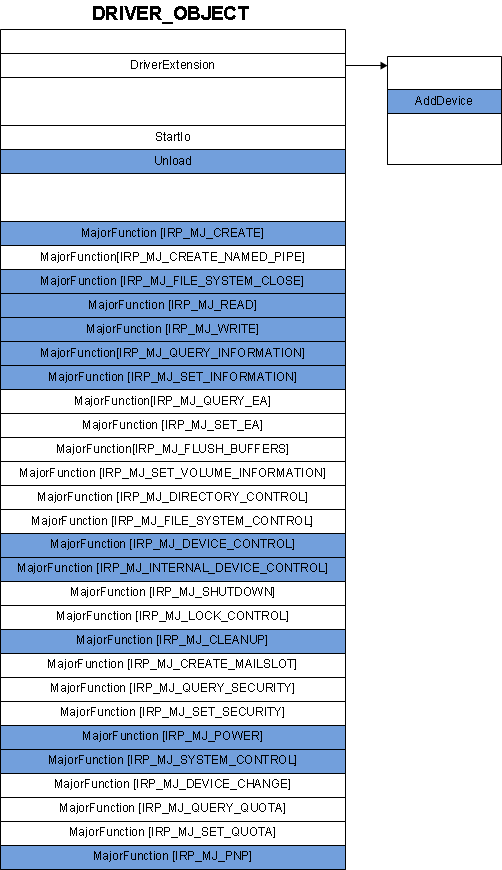

**使用驱动对让驱动编写简化**

一段时间内，微软内部或外部的驱动开发者都获得了WDM开发的经验，他们发现了一些关于分发函数的问题：

* 分发函数大部分是样本代码。例如，`IRP_MJ_PNP`的分发函数的大部分代码对于所有的驱动来数相同。只有一小部分的即插即用代码对于某个驱动控制单独硬件的部分是特殊的代码。
* 分发函数比较复杂，很难写正确。实现像线程同步，IRP排队，IRP取消这些功能都是比较有挑战的，要求对操作系统的工作原理有深入理解。

为了让驱动开发者的工作容易一些，微软创建了几个特定技术的驱动模型。起初来看，特定技术模型似乎相互之间大不相同，但是详细看就会发现他们有很多类似处：

* 驱动被分为两部分：一部分进行通用处理，另外一部分进行针对特定设备的特殊处理。
* 通用部分有微软编写。
* 特殊部分可能是微软编写，或者独立的硬件供应商。

假设`Contoso`和`Proseware`公司都生产玩具机器人，机器人需要一个WDM驱动。同时假设微软提供了一个通用机器人驱动，名字叫做`GeneralRobot.sys`。`Proseware`和`Contoso`可以各自编写小驱动，用于处理他们各自特定的机器人的需求。例如，`Proseware`可能编写了一个驱动 `ProsewareRobot.sys`，那么驱动对（ProsewareRobot.sys, GeneralRobot.sys）就可以结合形成一个单独WDM驱动。同样，驱动对（ContosoRobot.sys, GeneralRobot.sys）可以结合形成一个单独的WDM驱动。最通用的形式是可以使用（specific.sys，general.sys）驱动对创建驱动。

**驱动对中的函数指针**

在一个驱动对（specific.sys，general.sys）中，Windows加载 `specific.sys` 驱动，并且调用它的`DriverEntry` 函数。`specific.sys`的`DriverEntry` 函数接收一个指向`DRIVER_OBJECT`结构体的指针作为参数。通常，你可能认为在 `DriverEntry` 中填写几个 `MajorFunction` 数组的元素，用于指向分发函数；同时也会期望在 `DriverEntry` 中填写`DRIVER_OBJECT` 结构体的 `Unload` 成员以及驱动对象扩展的`AddDevice` 成员。然而，在驱动对模型中，`DriverEntry` 不会做这些工作。`specific.sys` 的 `DriverEntry` 函数会传递 `DRIVER_OBJECT` 结构体到`general.sys`实现的初始化函数。如下的代码例子给出了在（ProsewareRobot.sys, GeneralRobot.sys）驱动对中如何调用初始化函数。

```
PVOID g_ProsewareRobottCallbacks[3] = {DeviceControlCallback, PnpCallback, PowerCallback};

// DriverEntry function in ProsewareRobot.sys
NTSTATUS DriverEntry (DRIVER_OBJECT *DriverObject, PUNICODE_STRING RegistryPath)
{
   // Call the initialization function implemented by GeneralRobot.sys.
   return GeneralRobotInit(DriverObject, RegistryPath, g_ProsewareRobottCallbacks);
}
```

在 `GeneralRobot.sys` 的初始化函数写函数指针到对应的 `DRIVER_OBJECT` 成员中，以及数组`MajorFunction` 的适当元素。想法是当`I/O`管理器发送IRP到驱动对中，IRP首先进入`GeneralRobot.sys` 实现的分发函数；如果`GeneralRobot.sys`自己可以处理IRP，那么特定的驱动`ProsewareRobot.sys`就不会被调用到。如果`GeneralRobot.sys`可以处理一部分IRP（并非全部），它会调用 `ProsewareRobot.sys` 实现的回调函数。`GeneralRobot.sys`在`GeneralRobotInit`调用中获取到`ProsewareRobot`回调的指针。


在`DriverEntry`返回后，则为`Proseware Robot`设备节点就建立起了设备栈，设备栈可能类似下图：

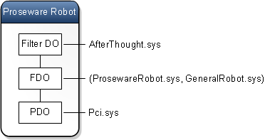

如前面的图所示，`Proseware Robot`的设备栈有三个设备对象。顶层的设备对象是过滤设备对象（Filter DO），与之关联的驱动是 `AfterThought.sys`。中间的设备对象是功能设备对象（FDO），与之关联的驱动对为（ProsewareRobot.sys, GeneralRobot.sys），驱动对作为功能驱动服务器设备栈。底层的设备对象是物理设备对象（PDO），与之关联的驱动为`Pci.sys`。

注意驱动对只占据了设备栈的一层，并且也只与一个设备对象关联：FDO。当`GeneralRobot.sys`处理IRP时，它会调用`ProsewareRobot.sys`作为辅助，但是这与传递请求到下层设备栈是不同的。驱动对形成了一个单一的WDM驱动，它们在设备栈中是一层。驱动对或者完成IRP，或者将它传递给下层设备栈对象，即PDO。

**驱动对实例**

假设在你的笔记本上有一个无线网卡，通过设备管理器可以确定`netwlv64.sys`是网卡的驱动。可以使用`!drvobj`调试扩展查看驱动`netwlv64.sys`的函数指针：

```
1: kd> !drvobj netwlv64 2
Driver object (fffffa8002e5f420) is for:
 \Driver\netwlv64
DriverEntry:   fffff8800482f064 netwlv64!GsDriverEntry
DriverStartIo: 00000000 
DriverUnload:  fffff8800195c5f4 ndis!ndisMUnloadEx
AddDevice:     fffff88001940d30 ndis!ndisPnPAddDevice
Dispatch routines:
[00] IRP_MJ_CREATE                      fffff880018b5530 ndis!ndisCreateIrpHandler
[01] IRP_MJ_CREATE_NAMED_PIPE           fffff88001936f00 ndis!ndisDummyIrpHandler
[02] IRP_MJ_CLOSE                       fffff880018b5870 ndis!ndisCloseIrpHandler
[03] IRP_MJ_READ                        fffff88001936f00 ndis!ndisDummyIrpHandler
[04] IRP_MJ_WRITE                       fffff88001936f00 ndis!ndisDummyIrpHandler
[05] IRP_MJ_QUERY_INFORMATION           fffff88001936f00 ndis!ndisDummyIrpHandler
[06] IRP_MJ_SET_INFORMATION             fffff88001936f00 ndis!ndisDummyIrpHandler
[07] IRP_MJ_QUERY_EA                    fffff88001936f00 ndis!ndisDummyIrpHandler
[08] IRP_MJ_SET_EA                      fffff88001936f00 ndis!ndisDummyIrpHandler
[09] IRP_MJ_FLUSH_BUFFERS               fffff88001936f00 ndis!ndisDummyIrpHandler
[0a] IRP_MJ_QUERY_VOLUME_INFORMATION    fffff88001936f00 ndis!ndisDummyIrpHandler
[0b] IRP_MJ_SET_VOLUME_INFORMATION      fffff88001936f00 ndis!ndisDummyIrpHandler
[0c] IRP_MJ_DIRECTORY_CONTROL           fffff88001936f00 ndis!ndisDummyIrpHandler
[0d] IRP_MJ_FILE_SYSTEM_CONTROL         fffff88001936f00 ndis!ndisDummyIrpHandler
[0e] IRP_MJ_DEVICE_CONTROL              fffff8800193696c ndis!ndisDeviceControlIrpHandler
[0f] IRP_MJ_INTERNAL_DEVICE_CONTROL     fffff880018f9114 ndis!ndisDeviceInternalIrpDispatch
[10] IRP_MJ_SHUTDOWN                    fffff88001936f00 ndis!ndisDummyIrpHandler
[11] IRP_MJ_LOCK_CONTROL                fffff88001936f00 ndis!ndisDummyIrpHandler
[12] IRP_MJ_CLEANUP                     fffff88001936f00 ndis!ndisDummyIrpHandler
[13] IRP_MJ_CREATE_MAILSLOT             fffff88001936f00 ndis!ndisDummyIrpHandler
[14] IRP_MJ_QUERY_SECURITY              fffff88001936f00 ndis!ndisDummyIrpHandler
[15] IRP_MJ_SET_SECURITY                fffff88001936f00 ndis!ndisDummyIrpHandler
[16] IRP_MJ_POWER                       fffff880018c35e8 ndis!ndisPowerDispatch
[17] IRP_MJ_SYSTEM_CONTROL              fffff880019392c8 ndis!ndisWMIDispatch
[18] IRP_MJ_DEVICE_CHANGE               fffff88001936f00 ndis!ndisDummyIrpHandler
[19] IRP_MJ_QUERY_QUOTA                 fffff88001936f00 ndis!ndisDummyIrpHandler
[1a] IRP_MJ_SET_QUOTA                   fffff88001936f00 ndis!ndisDummyIrpHandler
[1b] IRP_MJ_PNP                         fffff8800193e518 ndis!ndisPnPDispatch
```

在调试器的输出中，可以看到 `parport.sys` 实现了 `GsDriverEntry` 函数，即驱动的入口点。`GsDriverEntry` 都是编译驱动过程中自动构建进去的，它会执行一些初始化，然后调用驱动开发者实现的`DriverEntry`函数。

在这个例子中，`netwlv64.sys`驱动实现了`DriverEntry`函数，但是`ndis.sys`实现了`AddDevice`，`Unload`和几个分发函数。`Netwlv64.sys`被称为NDIS的miniport驱动，`ndis.sys`被称为NDIS库。将它们放到一起，两个模块形成了（NDIS miniport, NDIS Library）驱动对。

这个图显示了无线网卡的设备栈。注意，驱动对（netwlv64.sys, ndis.sys）占据了设备栈中的一层，并且只与一个设备对象相关联：FDO。

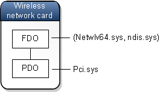

**可用驱动对**

不同的特定技术驱动模型使用了各种驱动对特定部分和通用部分的名字，在很多情况下，驱动对的特殊部分有前缀`mini`，如下有一些(specific, general)驱动对的可用实例：

* (display miniport driver, display port driver)
* (audio miniport driver, audio port driver)
* (storage miniport driver, storage port driver)
* (battery miniclass driver, battery class driver)
* (HID minidriver, HID class driver)
* (changer miniclass driver, changer port driver)
* (NDIS miniport driver, NDIS library)

> 注：如你在列表所见，几个模块在驱动对的通用部分使用了术语class driver，这种类驱动不同于单独的类驱动，也不同于类过滤驱动。

###KMDF通用驱动对模型###

在这个话题中，讨论KMDF框架能够被看作通用的驱动对模型。在阅读这个话题之前应该已经理解了`Minidrivers and driver pairs`中的思想。

随着时间推移，微软已经创建了几个特定技术驱动模型：

* 驱动被分为两部分：一部分用于处理通用功能，另外一部分用于处理特定设备的特殊操作。
* 通用部分被称为框架，由微软编写。
* 特殊部分被称为KMDF驱动，可能由微软编写也可由独立的硬件供应商编写。

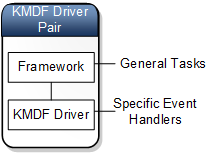

驱动对的框架部分执行通用的任务，通常对于大部分驱动都一样。例如，框架能够处理`I/O`请求队列，线程同步，大部分的电源管理的任务。

框架持有KMDF驱动的分发函数表，当一些组件发送了IRP到 (KMDF driver, Framework) 驱动对，IRP则首先进入框架驱动中，如果框架能够自己处理IRP，那么KMDF驱动就不会被调用。如果框架不能自己处理IRP，它需要通过调用KMDF驱动实现的事件处理函数来得到帮助。如下是一些KMDF驱动应该实现的事件处理函数：

* EvtDevicePrepareHardware
* EvtIoRead
* EvtIoDeviceControl
* EvtInterruptIsr
* EvtInterruptDpc
* EvtDevicePnpStateChange

例如，USB2.0 主控制器驱动有特殊部分名字叫`usbehci.sys`，以及通用功能部分`usbport.sys`。`usbehci.sys`被称为USB2.0 Miniport驱动，具有针对USB 2.0 主控制器的代码。`Usbport.sys` 被称为USB Port驱动，具有USB2.0和USB1.0都需要使用的通用代码。驱动对（usbehci.sys, usbport.sys）结合成一个WDM驱动用于服务USB2.0主控制器。

(specific, general) 驱动对针对不同的设备技术具有不同的名字，大部分的特定设备驱动都有前缀`mini`，通用驱动通常被称为端口驱动或类驱动，如下有一些(specific, general) 驱动对的例子：

* (display miniport driver, display port driver)
* (USB miniport driver, USB port driver)
* (battery miniclass driver, battery class driver)
* (HID minidriver, HID class driver)
* (storage miniport driver, storage port driver)

随着越来越多的驱动对模型被开发出来，了解所有不同的编写驱动的方法就很困难。每个模型都有自己的接口用于通用驱动和设备特定驱动通信。为一种设备技术（比如音频）开发驱动的知识与为另外一种（比如存储）设备技术开发驱动所要求的知识完全不同。

随着时间推移，开发者意识到将内核模式驱动对抽象为一种统一模型非常有益。KMDF就是Vista上第一个可用的这样的统一模型，完全满足需求。基于KMDF的驱动类似于许多特定技术驱动对模型。

* 驱动被分为两部分：一部分处理通用功能，另外一部分用于某个设备的特定功能。
* 通用部分由微软编写，被称为框架。
* 特殊部分由微软或独立的硬件供应商编写，被称为KMDF驱动。

USB3.0 主控制器驱动就是一个基于KMDF框架的驱动例子。这个例子中，两个驱动都是由微软编写。通用驱动是框架，特定设备驱动是 USB3.0 主控制器驱动。如下图说明了USB3.0 主控制器的设备节点和设备栈。

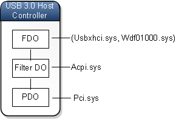

在图中，`Usbxhci.sys` 是`USB 3.0`主控制器驱动程序。它与`Wdf01000.sys`结对，(usbxhci.sys, wdf01000.sys)驱动对就形成了一个单一的WDM驱动程序，它作为`USB 3.0`主控制器的功能驱动。注意，驱动对占据了设备栈中的一层，由一个设备对象表示。这个表示 (usbxhci.sys, wdf01000.sys) 驱动对的设备对象是`USB3.0`主控制器的功能设备对象（FDO）。

在（KMDF driver, Framework）驱动对中，框架处理内核模式驱动的通用任务，例如框架可以处理IRP排队，线程同步，大部分的即插即用任务以及大部分的电源管理任务。KMDF驱动处理需要与特定设备交互的任务。KMDF驱动通过将框架调用的事件处理函数注册给框架来参与到请求处理中。

###KMDF扩展和驱动三元组###

这篇文章中，讨论KMDF的基于类的扩展。在阅读这个话题之前，应该理解`Mini驱动和驱动对`和`KMDF作为通用驱动对模型`两个文章中的观点。

对于一些设备类，微软提供了KMDF扩展，它可以进一步减少KMDF驱动必须进行的处理。使用基于类的KMDF扩展有如下三部分，我们称为驱动三元组：

* 框架用来处理大部分驱动的通用任务
* 基于类的框架扩展用来处理属于特定类设备的操作
* KMDF驱动处理特定设备的操作

在驱动三元组（KMDF driver, device-class KMDF extension, Framework）中的三个驱动组和形成了一个单一的WDM驱动。

设备类的KMDF扩展的一个例子是`SpbCx.sys`，它是简单外围设备总线（SPB）设备类的KMDF扩展。SPB类包括同步串行总线，比如I2C和SPI。I2C总线控制器的驱动三元组应该像如下形式：

* 框架处理大部分驱动的共同所需的任务。
* SpbCx.sys 处理特定于SPB总线类的任务，这些任务对于所有的SPB总线都是相同的。
* KMDF驱动处理特定于I2C总线的任务，我们叫这个驱动`MyI2CBusDriver.sys`。

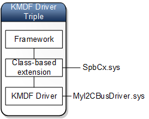

在驱动三元组中的三个驱动 (MyI2CBusDriver.sys, SpbCx.sys, Wdf01000.sys) 组合形成了一个WDM驱动，它作为I2C总线控制器的功能驱动。Wdf01000.sys（框架）持有驱动的分发表，当组件发送IRP到三元组时，IRP首先进入 wdf01000.sys。如果 `wdf01000.sys` 能够自己处理IRP，那么就不会调用 `SpbCx.sys` 和 `MyI2CBusDriver.sys` 驱动了。如果 `wdf01000.sys` 不能自己处理 IRP，那么它会调用 `SbpCx.sys` 中的事件处理函数来获得帮助。

如下有一些事件处理函数需要 `MyI2CBusDriver.sys` 驱动实现:

* EvtSpbControllerLock
* EvtSpbIoRead
* EvtSpbIoSequence

如下是 `SpbCx.sys` 需要实现的事件处理函数：

* EvtIoRead

###驱动的上下边界###

参与到`I/O`请求处理的驱动序列被称为驱动栈，驱动可以调用设备栈中低一层上边界；驱动也可以调用驱动栈中高一层驱动的下边界。在阅读这个话题之前，应该已经理解了`设备节点和设备栈`和`驱动栈`两篇文章中的观点。

`I/O`请求首先被驱动栈的顶层驱动处理，然后被低一层驱动处理，直到IRP被完整处理。

当驱动实现一组高一层驱动可以调用的函数集合时，这个函数集合就被称为驱动的上边界，或驱动的上边界接口。当驱动实现了一组低一层驱动可以调用的函数集合时，这一组函数集合被称为驱动的下边界，或者叫做驱动的下边界接口。

**音频例子**

我们考虑一个驱动栈中位于音频端口驱动下面的miniport驱动，端口驱动调用miniport驱动的上边界；miniport驱动调用端口驱动的下边界。

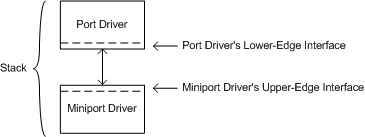

前图说明了将驱动栈中将端口驱动放在miniport驱动之上有时很有用。因为`I/O`请求首先被端口驱动处理，然后调用miniport驱动处理，这样认为端口驱动在miniport驱动之上很合理。但是请记住（miniport，port）驱动对通常位于设备栈中的一层，如下所示：

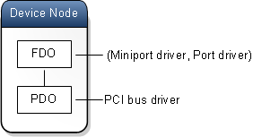

注意设备栈与驱动栈不同，对于这些属于定义，以及一对驱动如何形成驱动栈中只占据一层的WDM驱动，参考`Mini驱动和驱动对`一文。

如下有另外一种方法绘制上述相同的设备节点和设备栈：

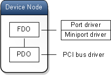

在前面途中，我们看到（miniport，port）驱动对形成了一个WDM驱动，并且只与设备栈中的一个设备对象（FDO）关联。也就是说，（miniport，port）驱动对在设备栈中只占据一层，但是我们也看到了miniport驱动和端口驱动之间的垂直关系。端口驱动是在miniport驱动上面，意味着端口驱动首先处理`I/O`请求，然后调用到`miniport`驱动中进行更进一步处理。

当端口驱动调用miniport驱动的上边界接口时，关键一点是它与将`I/O`请求向设备栈下方传递并不相同。在驱动栈（非设备栈）中，你可以选择将端口驱动画在miniport驱动上方，但这并不意味着在设备栈中端口驱动位于miniport驱动上方。

**NDIS例子**

有时驱动直接调用低一层驱动上边界。例如，假设在驱动栈中，`TCP/IP`协议驱动位于NDIS的miniport驱动上方。miniport驱动实现了一组`MiniportXxx`的函数，这形成了该驱动的上边界。我们说`TCP/IP`协议驱动绑定到NDIS miniport驱动的上边界。但是`TCP/IP`驱动并不直接调用`MiniportXxx`函数，它调用NDIS库中函数，这些函数会调用`MiniportXxx`函数。


前面的图给出了驱动栈，下面的图给出了同一个驱动的另一个视角：

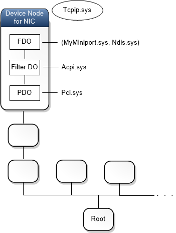

前图给出了网卡的设备节点，设备节点在即插即用设备树上有一个位置，NIC的设备节点有一个包含三个设备对象的设备栈。注意NDIS miniport驱动和NDIS库成对工作。驱动对（MyMiniport.sys, Ndis.sys）形成了一个WDM驱动，它有功能设备对象（FDO）表示。

同时也要注意，协议驱动`Tcpip.sys`并不是NIC设备栈的一部分。实际上，`Tcpip.sys`甚至不是即插即用设备树的一部分。

**总结**

术语上边界和下边界用于描述设备栈中两个驱动的通信接口。驱动栈不同于设备栈，在设备栈中显示的垂直方向的两个驱动或许形成了一个驱动对，它位于设备栈中的一层中。一些驱动并不是即插即用设备树的一部分。


By Andy@2018-11-17 12:14:32