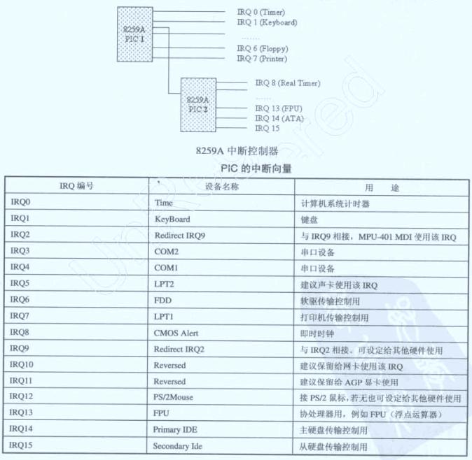

#中断#

###中断###

Windows的中断请求分为软件中断和硬件中断，并且将这些中断映射成了不同的级别的中断请求级（IRQL）。中断请求（IRQ）一般有两种，一种是外部中断，也就是硬件产生的中断；另外一种是由软件指令`int n`产生的中断。

传统的PC中，使用中断芯片`8259A`，一般可接收16个中断信号，每个中断信号对应一个中断号（该芯片为编程芯片，中断号可改）。外部的中断则分为不可屏蔽中断（NMI）和可屏蔽中断，分别由两根引脚NMI和INTR来接收。一般主从两片`8259A`级联形成15个中断（其中一个用于级联），然后通过INTR链接到CPU。如下图为级联形式以及PIC中断向量。



现在的计算机基本都是用了高级可编程控制器，即APIC（Advanced Programmable Interrupt Controller）。APIC兼容PIC，并且APIC的IRQ的数量都增加了。

APIC中IRQ的数量被增加到24个，每个IRQ有各自的优先级，正在运行线程随时可以被中断打断，进入中断处理程序。Windows将中断概念进行扩展，提出了中断请求级（IRQL）的概念，其中规定了32个中断请求级别，`0-2`级别为软件中断，`3-31`为硬件中断（其中就包括了APIC的24个中断），优先级从0到31逐级递增。

Windows的24个IRQ映射到了从`DISPATCH_LEVEL`到`PROFILE_LEVEL`之间（不包括），不同硬件的中断处理程序运行在不同的IRQL级别中。硬件的IRQL被称为设备中断请求级，简称DIRQL。Windows大部分时间运行在软件中断级别中，当设备中断到来时，操作系统提升IRQL至对应的DIRQL级别并运行中断处理函数；当中断处理函数结束后，操作系统把IRQL降到原来级别。

>注意一点，`DISPATCH_LEVEL`及之上的级别会屏蔽软中断，而内存分页机制依赖于系统的缺页异常，因此在这个级别以及更高级别运行时不能使用分页内存。

`KeGetCurrentIrql()`用于获取当前的IRQL数值，`KeRaiseIrql()`和`KeLowerIrql()`分别用于提升和降低当前的IRQL级。

###中断过程###

每个CPU有一张中断表，简称IDT。Windows系统中的中断响应函数位于中断描述符表中。当发生中断时，CPU根据优先级使用中断号在IDT表查找处理函数，然后调用处理函数。

IDT的整体布局可以按照`异常->空白->5系->硬`顺序来进行记忆：

* 异常：前20个表项存放着各个异常的描述符（IDT表不仅可以放中断描述符，还放置了所有异常的异常处理描述符，0x00-0x13）
* 保留：0x14-0x1F，它是Intel保留的范围，忽略这块号段。
* 空白：接下来存放一组空闲的保留项(0x20-0x29)，供系统和程序员自己分配注册使用
* 5系：`0x2A`开始是系统注册的5个预定义的软中断向量（0x2A-0x2E共5个系统预注册的中断向量，0x2A：KiGetTickCount，0x2B:KiCallbaclReturn，0x2C:KiRaiseAssertion，0x2D:KiDebugService，0x2E:KiSystemService）
* 硬：最后剩余的表项供驱动程序注册硬件中断使用和自定义注册其他软中断使用（0x30-0xFF）

> Windows系统中，0x30-0xFF这块号段留给了硬件和用户自己使用。事实上，这块号段的开头部分默认都是留给硬件IRQ使用。IRQ N默认映射到中断号0x30+N，如IRQ0用于系统时钟，系统时钟中断号默认对应就是0x30。当然程序员也可以修改APIC（高级可编程中断控制器）将IRQ映射到自定义的中断号。

> 虽然一个IRQ只对应一个中断号，但是由于IRQ数量有限，而设备种类成千上万，因此多个设备可以使用同一个IRQ，进而，多个设备可以分配同一个中断号。因此，一个中断号可以共享给多个设备同时使用。

比如早些时候的Windows系统中使用`int 2Eh`作为系统调用方式，其实就是触发软中断进入内核，然后`2Eh`索引对应的函数为`KiSystemService`，该函数就负责系统调用过程（参数检查，栈处理等）。

这里要区分中断号与中断请求级（IRQL），它们不是相关的概念。中断号是索引中断描述符表用的值；中断请求级是Windows中定义的概念，用于将IRQ映射到不同的级别上。

###DPC###

对于操作硬件的驱动来说，在初始化时需要注册中断，用于响应硬件的中断信号。在驱动中调用`IoConnectInterrupt`将中断对象与中断服务例程联系起来，当硬件触发中断就会调用到ISR中处理。

正常的硬件中断触发时，系统处于DIRQL级别，要高于普通线程的优先级。由于IRQL比较高，不适合执行长时间的任务。系统提供了DPC（Delay Process Call，延迟过程调用），它运行在`DISPATCH_LEVEL`，当系统从高IRQL恢复到`DISPATCH_LEVEL`级别时DPC就会依次从队列中弹出并执行相应的DPC例程。

硬件中断响应使用DPC的例子代码如下：

```
//初始化DPC
KeInitializeDpc(&pdx->DPC, DpcForISR, (PVOID)context);

// 将不重要的中断处理放到DPC例程中处理
IoReqeustDpc(device, device->CurrentIrp, NULL);
```

`KeInitializeDpc()`用于初始化一个DPC对象，`IoRequestDpc()`用于将DPC插入到系统的DPC队列中等待执行。


By Andy@2019-02-18 09:31:12