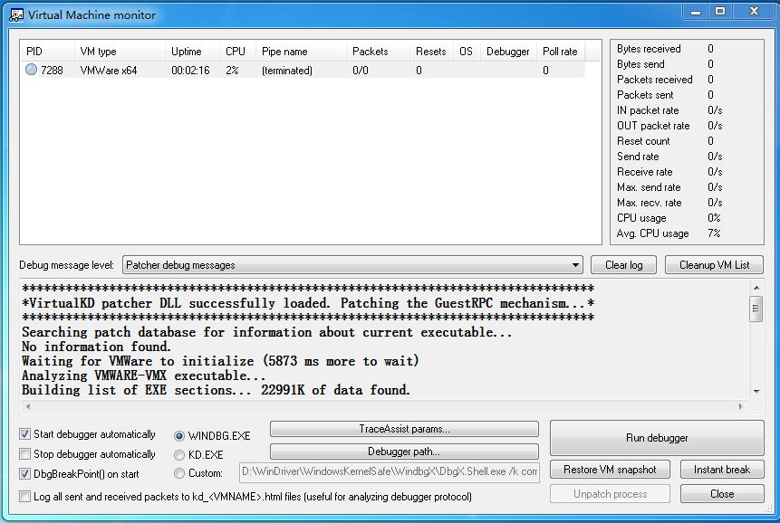
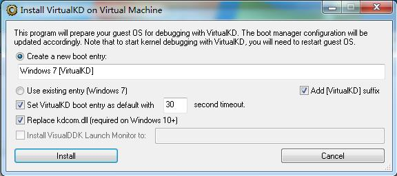

#驱动开发环境#

Windows驱动开发环境比应用程序开发要复杂一些，所需要的程序如下：

1. Visual Studio XXX
2. WDK
3. Windbg
4. 虚拟机软件（VMWare等）
5. 系统镜像（XP/Win7/Win10等）

开发环境首先需要编译环境，这里选择`Visual Studio`，它一方面可以方便程序编辑，另一方面可以进行驱动工程创建与编译。WDK是驱动开发必须的，就如同应用开发中的SDK一样。这两个不用多言，直接下载相应版本并且安装即可。

程序开发中很重要的一部分是程序测试与调试，这里需要搭建测试与调试环境。正常可以在本机进行测试，但是由于驱动中一旦出现错误很容易造成系统蓝屏，严重可能造成本机系统损坏，导致不必要的损失；如果要在实体机上进行调试，那就需要两台物理机器，这样成本比较大，并且如果驱动有问题也可能造成前面说的很多问题。所以安装虚拟机进行调试和测试是比较方便和明智的做法。安装了虚拟机可以使用双机调试的方式，用本机的Windbg调试虚拟机中的系统，进而可以可以调试驱动。

关于上述软件的安装以及虚拟机中的系统安装都是比较简单的事情，这里不再详细说明。下面说一下双机调试环境如何建立。

###串口连接双机###

一、对于XP/2003及其之前的系统，配置C盘下的 boot.ini文件如下；

[boot loader]
timeout=30
default=multi(0)disk(0)rdisk(0)partition(1)\WINDOWS
[operating systems]
multi(0)disk(0)rdisk(0)partition(1)\WINDOWS="Microsoft Windows XP Professional" /noexecute=optin /fastdetect
multi(0)disk(0)rdisk(0)partition(1)\WINDOWS="Microsoft Windows XP Professional debug" /noexecute=optin /fastdetect /debug /debugport=com2 /baudrate=115200

注意 /debugport=com2 这一个选项：
    因为最新的VMWare中，COM1被默认为打印机共享使用，如果配置为COM1，根本链接不上。此处使用COM。
    从虚拟机的设置中，添加COM端口时，也可以看到其实添加的为串行端口2

二、Win7 及其之后的系统：

1. 使用 bcdedit 进行配置：
    bcdedit /?      查看帮助
    
    bcdedit /enum OSLOADER          // 枚举所有的加载器
    
    bcdedit /copy {current} /d "Windows 7 Debug"
    bcdedit /debug ON
    bcdedit /bootdebug ON
    
    bcdedit /dbgsetting     // 设置调试配置  波特率等
    
    bcdedit /timeout 7      // 设置超时时间
    
示例：
    1. 以管理员身份运行cmd
    2. 在命令提示行中输入如下命令复制开机启动项：
        bcdedit /copy {current} /d "for debug"      复制当前开机启动项，复制项目的描述为"for debug"。（描述显示为引导菜单标题）
    3、记录下返回标识，便于编辑:
        本例中，返回的GUID为：{edc961e6-0a37-11df-a30a-92cc1b2fa135}
        
    4、在命令提示行中输入如下命令，启用复制项系统加载器的启动调试
        bcdedit /bootdebug {edc961e6-0a37-11df-a30a-92cc1b2fa135} ON
        
    5、在命令提示行中输入如下命令设置全局调试程序在com1上以115200波特进行串行调试：
        bcdedit /dbgsettings SERIAL DEBUGPORT:1 BAUDRATE:115200
        
    6、在命令行中输入如下命令启用内核调试
        bcdedit /debug {edc961e6-0a37-11df-a30a-92cc1b2fa135} ON    
    
    
2. 图形化的界面操作：
    WIN+R 打开运行输入msconfig打开启动配置对话框设置调试
    
    选择"引导"标签，点击"高级选项"按钮，弹出高级设置。
    
    勾选"调试"复选框，"全局调试设置"组内的内容即可编辑。
    
    选择调试端口，波特率即可。

###使用VirtualKD###

上一节中可以看到，直接配置Windbg双击调试还是比较麻烦的，同时还会有性能问题，导致双击数据传输非常慢，有一个工具专门用于配置双机调试——VirtualKD。`VirtualKD`工具可以免去Windbg双击调试的琐碎配置，并且极大提高双机调试时的响应速度。

`VirtualKD`是开源的程序，可以从`VirtualKD`的主页（[http://virtualkd.sysprogs.org/](http://virtualkd.sysprogs.org/)）下载。

`VirtualKD`程序是自减压程序，直接放到指定目录即可。其中包含了`vmmon.exe`和`vmmon64.exe`，它们是虚拟机的监视器，分别用于X86和X64系统上。启动它们后可以看到当前有几个虚拟机在运行，

点击`Debugger path...`按钮可以选择Windbg的路径，对于不是安装包安装的Windbg可能需要使用它选择一下目录。

在`VirtualKD`的安装目录中包含一个`target`目录，将`target`目录放到虚拟机系统中，并运行。如下图所示，默认选项，直接点击`Install`即可。其中`Windows 7[VirtualKD]`为添加的启动项，这个可修改。

然后提示重启，重启时选择前面的调试启动项即可。这样在系统启动时`VirtualKD`会自动将Windbg启动起来，接下来就可以正常使用Windbg调试虚拟机中的系统了。

> 注：在使用VMWare时，安装完虚拟机中的系统之后，一方面要安装虚拟机工具`VMWare Tools`，另一方面如前面所述，虚拟机默认添加打印机设备，虚拟机中系统的串口1被占用了，这样会导致`VirtualKD`配置出问题。防止配置出问题再修改，在安装完虚拟机时就从虚拟机设置中将打印机设备删除掉，这样就空出来串口1了。

By Andy@2018-11-12 20:09:23

